*****
# READING and RESOURCES

1. Galaxy toolkit pipeline
[Essential genes detection with Transposon insertion sequencing](https://galaxyproject.github.io/training-material/topics/genome-annotation/tutorials/tnseq/tutorial.html#count-the-number-of-insertion-per-ta-sites)

2. DeJesus paper on saturated Mtb libraries
[DeJesus et al, 2017. Comprehensive Essentiality Analysis of the Mycobacterium Tuberculosis Genome via Saturating Transposon Mutagenesis](https://pubmed.ncbi.nlm.nih.gov/28096490/)
\cite{Dejesus2017}

3. TRANSIT 
[DeJesus, M.A., Ambadipudi, C., Baker, R., Sassetti, C., and Ioerger, T.R. (2015). TRANSIT - a Software Tool for Himar1 TnSeq Analysis. PLOS Computational Biology, 11(10):e1004401](https://journals.plos.org/ploscompbiol/article?id=10.1371/journal.pcbi.1004401)

4. Transit HMM
[DeJesus, M.A., Ioerger, T.R. A Hidden Markov Model for identifying essential and growth-defect regions in bacterial genomes from transposon insertion sequencing data. BMC Bioinformatics. 2013. 14:303](http://www.ncbi.nlm.nih.gov/pubmed/24103077)

5. Re-sampling
[Subramaniyam S, DeJesus MA, Zaveri A, Smith CM, Baker RE, Ehrt S, Schnappinger D, Sassetti CM, Ioerger TR. (2019). Statistical analysis of variability in TnSeq data across conditions using Zero-Inflated Negative Binomial regression. *BMC Bioinformatics*. 2019 Nov 21;20(1):603. doi: 10.1186/s12859-019-3156-z.](https://www.ncbi.nlm.nih.gov/pmc/articles/PMC6873424/)

6. Tn-seq of M tb
[Zhang YJ, Ioerger TR, Huttenhower C, et al. Global assessment of genomic regions required for growth in Mycobacterium tuberculosis. PLoS Pathog. 2012;8(9):e1002946. doi:10.1371/journal.ppat.1002946](https://pubmed.ncbi.nlm.nih.gov/23028335/)

7. Tn-seq ncRNA
[A comparison of dense transposon insertion libraries in the Salmonella serovars Typhi and Typhimurium](https://www.ncbi.nlm.nih.gov/pmc/articles/PMC3632133/)

8. Transit docs
[Transit/tpp docs](https://transit.readthedocs.io/en/latest/transit_running.html)

9. BioTraDIS docs
[BioTraDIS git hub](https://github.com/sanger-pathogens/Bio-Tradis)

10. Tn-seq methods and protocols:  [Long, J. E. et al. Global Phenotypic Profiling. in Gene Essentiality: Methods and Protocols 1279, 79–95 (2015).](https://pubmed.ncbi.nlm.nih.gov/25636614/)

11. Overview of structure and practice of Tn-Seq experiments: [1. Chao, M. C., Abel, S., Davis, B. M. & Waldor, M. K. The Design and Analysis of Transposon-Insertion Sequencing Experiments. Nat Rev Microbiol 14, 119–128 (2016).](https://www.ncbi.nlm.nih.gov/pmc/articles/PMC5099075/)


**********
# Project Directory Organisation


```{bash}
bash -l
alias rm="rm -i"
cd /d/in16/u/sj003
my_path=$(echo $PWD)
```

### Directory for Mycobacteria project: /d/in16/u/sj003/

```
ls $my_path/
bin  dejesus_mtb  mbovis  ncbi  refseqs  scripts
```

bin: has 'bs' for Illumina basespace downloading

ncbi: has SRA files and configs for downloading with sra toolkit

dejesus_mtb:  contains all library sequence files and analysis for dejesus Mtb project
```
ls $my_path/dejesus_Mtb/
data  fastqc  multiqc  tpp_results  transit_results
```

mbovis: contains all library sequence files and analysis for mbovis project
```
ls $my_path/mbovis/
biotradis                                   MbovisTradis_61826796.json
B_S1_L001_R1_001.fastq.gz_13779964920.json  misc_data
B_S1_L001_R1_001.fastq.gz_14200555041.json  multiqc
bwa_mapped                                  tpp.cfg
data                                        tpp_results
fastqc                                      transit
Mbovis_SampleSheet.csv
```

refseqs: Mtb and mbovis folders contain all reference sequences and annotation files
```
ls $my_path/refseqs/
mbovis  Mtb
```

scripts: mainly bash scripts and parsers. will i put customised analysis scripts in here later??

To transfer local files to thoth (from local terminal):
```{bash}
scp ~/path-to-file/file-to-be-moved sj003@ssh.cryst.bbk.ac.uk:/d/in16/u/sj003/
```

To transfer thoth files to local (on local terminal):
```{bash}
~ jenstiens$ scp sj003@ssh.cryst.bbk.ac.uk:/d/in16/u/sj003/mbovis/bwa_mapped/2020_06_03_BAMs/multiqc_report.html /Users/jenstiens/Tn_seq_project/aln_multiqc_report.html
```


*************************************************************

# Data acquisition

## Downloading mbovis sequencing data from Illumina Basespace:
Install the 'bs' program in a 'bin' directory:
```{bash}
wget "https://api.bintray.com/content/basespace/BaseSpaceCLI-EarlyAccess-BIN/latest/1.1.0/amd64-linux/bs?bt_package=latest" -O $my_path/bin/bs
```

Change permissions
```{bash}
chmod u+x $my_path/bin/bs
```

Authenticate:
```{bash}
 ./bs auth
```

```
Please go to this URL to authenticate:  https://basespace.illumina.com/oauth/device?code=aZsUH
Welcome, Jennifer Stiens
```


Download data:
```{bash}
./bs download project --name MbovisTradis -o $my_path/MbovisTradis/
./bs contents project --name "MbovisTradis"
./bs download file --id "14200555041"
```


**Illumina basespace header info**

[MiSeq reporter software](https://emea.support.illumina.com/content/dam/illumina-support/documents/documentation/software_documentation/miseqreporter/miseq-reporter-software-guide-15042295-05.pdf)

first line of fastq file:
```@M01637:39:000000000-CDG9B:1:1101:16320:1637 1:N:0:ATGCCT```

```@<instrument>:<run number>:<flowcell ID>:<lane>:<tile>:<x-pos>:<y-pos> <read>:<is filtered>:<control number>:<sample number>```

[FASTQ Files BaseSpace](https://help.basespace.illumina.com/articles/descriptive/fastq-files/)

The R1 data from B library downloaded from basespace was wrong somehow. Reads are only 60bp long vs 151bp. Received new R1 data files from Ian at LSHTM and uploaded locally. These matched in length, but sequence headers lacked index. 

**Used bash scripting to edit and add index to headers:**

print number of times string appears in file:
```{bash}
grep -o 'N:0:AAACAT' B_S1_L001_R1_001.fastq | wc -l
```
edit headers of all reads:
```{bash}
awk '{if ($0 ~/^@M/) print substr($0, 1, length($0)-1)"AAACAT"; else print $0}' B_S1_L001_R1_001.fastq > B_S1_L001_R1_001_edited.fastq
```

(one of the seqs has adapter added on to quality b/c of @ symbol, found where problem was by using commands below)

print longest line:
```{bash}
 awk '{ if (length($0) > max) {max = length($0); maxline = $0} } END { print maxline }' B_S1_L001_R1_001.fastq
```
find line number of file that has the string from above:
(has adapter added on to quality b/c of @ symbol--changed awk script to '@M' to stop this from happening)
```{bash}
grep -n "@BBBBFFFFFBBGGGGGGGFGGHGHHHHGGHHHHHHFHHGFHHFFHHHHHHHGGGGECGHHCG?EGCEEGGG?EEEGGGGGGGGHHHHGGGHHEHHGDGGGGHHHGGGGGG?EEEGEGHGEFFHEFGHCCDCC?BGBF??-@DFFFF00BAAACAT" B_S1_L001_R1_001.fastq
```

After fixing the index sequence in header, R1 and R2 from B library still won't pair up properly. In some reads, the y-coordinates are different by one. Used the commands below to eliminate a couple of these reads:

how to print only the sequence from read file:
```{bash}
sed -n ‘2~4p' file
```
print selected lines (like one sequencing read):
```{bash}
sed -n ‘9321,9324p’ file
sed -n ‘9321,+3p’ file
## without -n will print all other lines except for indicated lines
```
delete selected lines and print remaining lines to file:
```{bash}
sed '9321,+3d' B_S1_L001_R1_001.fastq > B_S1_L001_R1_001_edited.fastq
```

Unfortunately, more discrepancies kept popping up. Means we can't use paired reads for this library unless we try to get another copy. However, as these reads are already de-duplicated by the Illumina MiSeq software and do not contain barcodes, there is no further need for the R2. (See email from Ian: unlikely to map with certainty to particular TA site except for reads with some of transposon tag sequenced.)

It seems that the reads are not barcoded (but as adapters are trimmed in MiSeq processing, can't know for sure), so there is no way to 'de-duplicate' the data as specified in DeJesus, etc, using a unique barcode and genomic suffix combination. 


## Downloading Mycobacterium sequences (gff and feature tables)

**16/06/2020 UPDATE**

must use .gff file "LT708304_updated_aug19.gff" because there was a mistake in the NCBI uploaded sequence. This is file Dong has given me to use from Stephen Gordon's group who re-annotated genome https://www.microbiologyresearch.org/content/journal/acmi/10.1099/acmi.0.000129?crawler=true

**from NCBI/Genbank to BBK server (08/06/2020):**

There are two assemblies, but should be quite similar? v2 is from 2020
https://ftp.ncbi.nih.gov/genomes/all/GCA/000/195/835/

to download latest version:

```{bash}
wget ftp://ftp.ncbi.nih.gov/genomes/all/GCA/000/195/835/GCA_000195835.2_ASM19583v2/GCA_000195835.2_ASM19583v2_genomic.gff.gz 
```

**Downloading Mycobacterium sequences (gff and feature tables) from Ensembl to bbk server:**
ftp://ftp.ensemblgenomes.org/pub/bacteria/release-47/gff3/bacteria_4_collection/mycobacterium_bovis_af2122_97/
(must use chrome as ftp not working on safari)
Could only download v1? But there was a v1.46 and a v1.47.Chromosome.chromosome. These were identical (used diff)

```{bash}
wget ftp://ftp.ensemblgenomes.org/pub/bacteria/release-47/gff3/bacteria_4_collection/mycobacterium_bovis_af2122_97/Mycobacterium_bovis_af2122_97.ASM19583v1.46.gff3.gz
```

List of all mbovis sequence and annotation files:
thoth.cryst.bbk.ac.uk> ls mbovis

These are downloaded via ftp from Genbank (above)
GCA_000195835.2_ASM19583v2_feature_table.txt.gz
GCA_000195835.2_ASM19583v2_genomic.gff.gz

'protein table' made using gff_to_prot in tpp:
```{bash}
convert gff_to_prot_table <.gff> <.prot_table>
```

```
LT708304.prot_table
LT708304_updated_aug19.gff

Mbovis_AF2122_97.fasta
Mbovis_AF2122_97.fasta.amb
Mbovis_AF2122_97.fasta.ann
Mbovis_AF2122_97.fasta.bwt
Mbovis_AF2122_97.fasta.pac
Mbovis_AF2122_97.fasta.sa
mbovis_ASM19583v2_feature_table.txt
mbovis_ASM19583v2.gff
mbovis_ASM19583v2.prot_table
Mycobacterium_bovis_af2122_97.ASM19583v1.46.gff3
Mycobacterium_bovis_af2122_97.ASM19583v1.47.chromosome.Chromosome.gff3
```

## Downloading DeJesus Mtb data from NCBI using SRA toolkit

'All TnSeq data sets are publicly available on the NCBI Sequence Read Archive
with accession number SRP083947 and BioProject accession number PRJNA341349.'

There are 14 different libraries, each with two reads.

```{bash}
module load ncbi-sra/v2.10.5 (in /s/software/modules)
```

to get accession list and metadata for deJesus files from NCBI website:

[ncbi link for accession SRP083947](https://www.ncbi.nlm.nih.gov/Traces/study/?acc=SRP083947&o=acc_s%3Aa)

1. download 'Accession list' (SRR_Acc_List.txt.csv)
2. transfer to ncbi/SRA folder

Table of Libraries and Accession numbers:

| Run Acc | SRA Acc | Lib No | Lib Name |
|---------|---------|--------|----------|
| SRR4113427 | SRX2084320 | 1 | WX-WT1 |
| SRR4113428 | SRX2084321 | 2 | WX-WT2 |
| SRR4113429 | SRX2084322 | 11 | SWP-WT7 |
| SRR4113430 | SRX2084323 | 12 | CB-WT |
| SRR4113431 | SRX2084324 | 13 | TraCS-053 |
| SRR4113432 | SRX2084325 | 14 | TraCS-054 |
| SRR4113433 | SRX2084326 | 3 | WX-WT3 |
| SRR4113434 | SRX2084327 | 4 | WX-WT2 |
| SRR4113435 | SRX2084328 | 5 | SWP-WT1 |
| SRR4113436 | SRX2084329 | 6 | SWP-WT2 |
| SRR4113437 | SRX2084330 | 7 | SWP-WT3 |
| SRR4113438 | SRX2084331 | 8 | SWP-WT4 |
| SRR4113439 | SRX2084332 | 9 | SWP-WT5 |
| SRR4113440 | SRX2084333 | 10 | SWP-WT6 |


to get a single library file from NCBI:

```{bash}
./prefetch SRR4113427
```


download from .csv accession list:

```{bash}
./prefetch $my_path/ncbi/SRR_Acc_List.txt.csv
```


script to perform validation step and fasterq-dump on each sra read file to convert .sra files to .fastq files and put in appropriate directory:

```{bash}
#!/bin/bash

#assign all files ending in .sra to FILES variable
FILES=*.sra

#Loop over FILES and assign each to file

for file in $FILES
do
	filename=$file
	echo “File on the loop:			$file”

	# validate file
	/d/in16/u/sj003/sratoolkit/bin/vdb-validate ${file}

	#use fasterq-dump to convert .sra files to .fastq files (-O for dest folder)
	/d/in16/u/sj003/sratoolkit/bin/fasterq-dump -O /d/in16/u/sj003/ncbi/files/dejesus/ ${file}
  
	echo -e “#######################\n\n”

done
```

```{bash}
bash sra_to_fastq.sh
```

```--split-files``` puts seq in one file and quality line in next file. if i use fasterq_dump without split files, get two fastq files for each accession number, _1 and _2

remove all .sra files


## Download second set of bovis samples from DROPBOX

[dropbox link from Sharon](https://www.dropbox.com/home/Iri%20Tn%20data/BaseSpace)


(copy link from website and change dl=0 to dl=1):

```{bash}
wget -O Mbovis2_B_S1_R2.fastq.gz "https://www.dropbox.com/s/hoxmd0u9uyshbqp/MbovisB_S1_L001_R2_001.fastq.gz?dl=1"
```


# Quality control of TraDIS and TnSeq data

*to loop unzip or gunzip multiple files in directory, use 
```"*.zip"``` in quotes as an argument*
```unzip "*.zip"```

1) Check for read length
```{bash}
head -50 <file.fastq>
```


2) Count number of reads:  R1 and R2 should match
```{bash}
wc -l <file.fastq>
# loop through and count reads:
for file in $FILES; do filename=$file; wc -l $file; done;
```


3) Run fastqc
```{bash}
module load python/v3
module load fastqc
fastqc B_S1_L001_R2_001.fastq 
firefox B_S1_L001_R2_001_fastqc.html
```

script to iterate through all files and run fastqc and multiqc:

```{bash}
#!/bin/bash

# iterate_fastqc.sh
# usage: bash iterate_fastqc.sh

FILES=*.fastq

for file in $FILES
do
	filename=$(basename "$file")
	filename="${filename%.*}"

	echo "File on the loop: 	$filename"

	#call fastQC quality analysis
	/s/software/fastqc/v0.11.8/FastQC/fastqc ${file}

	echo -e "########################\n\n"
done


# Run MultiQC
# -f overwrites existing files, . runs with files in current directory, -o output directory
echo "Running MultiQC..."
/s/software/python/v3/bin/multiqc -f . -o /d/in16/u/sj003/dejesus_mtb/multiqc
```


[MultiQC report Mtb data](images/mtb_multiqc_report.html)

[FastQC docs](https://www.bioinformatics.babraham.ac.uk/projects/fastqc/)
[MultiQC docs](https://multiqc.info/docs/)

*****************************************************************************

# Processing Reads 

When logging into server and using BioTradis or Transit (installed as python packages)
```{bash}
module load Python/v3
module load R
```

## Using TPP

[Transit/tpp docs](https://transit.readthedocs.io/en/latest/transit_running.html)
[tpp code github](https://github.com/mad-lab/transit/blob/master/src/pytpp/tpp_tools.py)

### Run TPP on DeJesus data

This data is paired-end, (but as we can only process Mbovis as single-end), we will run both paired-end and single-end tpp. Template counts are de-duplicated to eliminate PCR amplification jackpots, but this requires using unique barcodes and genomic end of R2.

```{bash}
tpp --help
```

parameters (default):
used Himar1 transposon, Sassetti protocol

for paired-end, single sample:
```{bash}
tpp -bwa /s/software/bwa/bwa/bwa -ref $my_path/refseqs/Mtb/Mtb_H37Rv.fasta -reads1 $my_path/ncbi/files/dejesus/SRR4113428_1.fastq -reads2 $my_path/ncbi/files/dejesus/SRR4113428_2.fastq -output $my_path/dejesus_mtb/tpp_results/SRR4113428
```


for single-end, single sample:
```{bash}
tpp -bwa /s/software/bwa/bwa/bwa -ref $my_path/refseqs/Mtb/Mtb_H37Rv.fasta -reads1 $my_path/ncbi/files/dejesus/SRR4113427_1.fastq -output dejesus-Mtb-SRR4113427_singleread
```

script to iterate with single-end processing:
```{bash}
#!/bin/bash
# module load python/v3
# usage: nohup bash $my_path/scripts/mtb_single_tpp.sh >& mtb_single.out &
# run from: /d/in16/u/sj003/dejesus_mtb/data/ 


FILES=*_1.fastq
for file in $FILES

do
        filename=$(basename "$file")
        filename="${filename%.*}"

        echo "File on the loop:         ${file}"
        
        tpp -bwa /s/software/bwa/bwa/bwa -ref /d/in16/u/sj003/refseqs/Mtb/Mtb_H37Rv.fasta -reads1 ${file} -output /d/in16/u/sj003/dejesus_mtb/tpp_results/${filename}


done 
```

to iterate through all 14 samples, run from: $my_path/dejesus_mtb/data

```{bash}
nohup bash $my_path/scripts/dejesus_iterate_tpp.sh >& dejesus_iterate_tpp.out &
```

(script, input directory \*if needed*\, saving output that prints to standard out)


```{bash}
#!/bin/bash
# usage: from inside dejesus_mtb/data directory
# bash $my_path/scripts/dejesus_iterate_tpp.sh

for i in $(ls *.fastq | rev | cut -c 9- | rev | uniq)
do

        echo "File on the loop:         $i"
        echo "Read 1:                   $1${i}_1.fastq"
        echo "Read 2:                   $1${i}_2.fastq"

        tpp -bwa /s/software/bwa/bwa/bwa -ref /d/in16/u/sj003/refseqs/Mtb/Mtb_H37Rv.fasta -reads1 $1${i}_1.fastq -reads2 $1${i}_2.fastq -output /d/in16/u/sj003/dejesus_mtb/tpp_results/paired_end/${i}


done


```

some libraries have error before mapping (28, 30):
```
[tn_preprocess] prefix sequence: ACTTATCAGCCAACCTGTTA
[tn_preprocess] Looking for start of Tn prefix within P,Q = [0,20]
[tn_preprocess] Error: Input files did not contain any reads matching prefix sequence with 1 mismatches
```

were these trimmed off before uploading to sra?
should we do this with 2 mismatches?

checking fastq files to see if they have prefix seq:
```{bash}
grep -n 'ACTTATCAGCCAACCTGTTA' $my_path/dejesus_mtb/data/SRR4113430_1.fastq | wc -l
```

28: 1
30: 24

these don't seem to have prefix seq but still have .sam file as bwa started (no tn_stats.txt file)?
34: 4 
38: 4
39: 8
40: 1
```[tn_preprocess] Error: BWA was unable to map any reads to the genome.```

try 30 again with 2 mismatches allowed
```{bash}
tpp -bwa /s/software/bwa/bwa/bwa -ref $my_path/refseqs/Mtb/Mtb_H37Rv.fasta -reads1 $my_path/dejesus_mtb/data/SRR4113430_1.fastq -reads2 $my_path/dejesus_mtb/data/SRR4113430_2.fastq -output $my_path/dejesus_mtb/tpp_results/paired_end/SRR4113430 -mismatches 2
```

Doesn't work any better
```Error: Input files did not contain any reads matching prefix sequence with 2 mismatches```

need to find out whether these were uploaded after trimming, or something else going on?
These are libraries 2, 12, 4, 8, 9 10

14/06/20
After email correspondence w/ T. Ioerger, informed that R1 and R2 have been switched in NCBI. Checked this for all 6 libraries with grep of tranposon tag which is present in 'R2' reads. Switched names (_2 to _1 and _1 to _22) and ran paired-end tpp again (with slightly altered bash script using list of altered libraries, seq_list.txt).

```{bash}
nohup bash $my_path/scripts/dejesus_iterate_tpp.sh seq_list.txt >& dejesus_iterate_tpp.out &
```

```{bash}
#!/bin/bash

input=$1
while IFS= read -r line
#for i in $(ls *.fastq | rev | cut -c 9- | rev | uniq)

do
	filename=$(basename "$line")
	filename="${filename%.*}"

	echo "File on the loop:		$line"
	echo "Read 1:			${filename}_1.fastq"
	echo "Read 2:			${line}_22.fastq"

	tpp -bwa /s/software/bwa/bwa/bwa -ref /d/in16/u/sj003/refseqs/Mtb/Mtb_H37Rv.fasta -reads1 ${line}_1.fastq -reads2 ${line}_22.fastq -output /d/in16/u/sj003/dejesus_mtb/tpp_results/paired_end/${line}


done <"$input"

```


### Run tpp on mbovis libraries (3)


```{bash}
#!/bin/bash

# usage: bash mbovis_iterate_tpp.sh list_of_files.txt

input=$1
while IFS= read -r line

do
	filename=$(basename "$line")
	extension="${filename##*.}"
	filename="${filename%.*}"

	echo "file on the loop:		$line"

	tpp -bwa /s/software/bwa/bwa/bwa -ref /d/in16/u/sj003/refseqs/Mbovis_AF2122_97.fasta -reads1 $line -output /d/in16/u/sj003/mbovis/tpp_results/${filename}_tpp

	echo "ouput:                    ${filename}_tpp"

done <"$input"
```

did run in paired-end mode, but there were no barcodes found
(data is definitely not bar-coded)

**How important is using both reads/barcode deduplication?**
What is typical read/template ratio in dejesus data (for those that mapped)?
27: 4.43
29, 31, 32, 33, 35, 36, 37: 1.12-1.76 range

Could de-duplicate, potentially, using paired end reads with samtools markdup?
http://www.htslib.org/doc/samtools-markdup.html

do we want to run this with custom primer (transposon sequence)?
ours is: tag=GTCTAGAGACCGGGGACTTATCAGCCAACCTGTTA, but it says not to put in whole thing, just beginning
Probably not necessary, as tpp has default sequences for himar1
this is sequence they use: ACTTATCAGCCAACCTGTTA (just shorter version?). Just needs to start between base 0 and 20.

list of files for each sample after tpp:
```
B_S1_L001_R1_001_tpp.counts
B_S1_L001_R1_001_tpp.reads1
B_S1_L001_R1_001_tpp.sam
B_S1_L001_R1_001_tpp.tn_stats
B_S1_L001_R1_001_tpp.trimmed1
B_S1_L001_R1_001_tpp.trimmed1_failed_trim
B_S1_L001_R1_001_tpp.wig
```

renamed all files with bash script "rename_files.sh"
```{bash}
#!/bin/bash

FILES=*_tpp.*

for file in $FILES

do
	filename=${file:0:1} 
	extension="${file##*.}"

	echo "${file}"
	echo "${filename}"
	echo "${extension}"

	mv ${file} ${filename}_R1.$extension	


done
```


.tn_stats gives all read counts, mapped reads, TA sites hit, insertion density, NZ_mean, etc (not max read count and skewness)

```
# transposon type: Himar1
# protocol type: Sassetti
# bwa flags: 
# read1: B_S1_L001_R1_001.fastq
# read2: 
# ref_genome: /d/in16/u/sj003/refseqs/Mbovis_AF2122_97.fasta
# replicon_ids: 
# total_reads (or read pairs): 1044485
# trimmed_reads (reads with valid Tn prefix, and insert size>20bp): 979489
# reads1_mapped: 799285
# reads2_mapped: 0
# mapped_reads (both R1 and R2 map into genome, and R2 has a proper barcode): 799285 
# read_count (TA sites only, for Himar1): 613959
# template_count: 613959
# template_ratio (reads per template): 1.00
# TA_sites: 73536
# TAs_hit: 15478
# density: 0.210
# max_count (among templates): 2548
# max_site (coordinate): 1806084
# NZ_mean (among templates): 39.7
# FR_corr (Fwd templates vs. Rev templates): 0.818
# BC_corr (reads vs. templates, summed over both strands): 1.000
# primer_matches: 25509 reads (2.4%) contain CTAGAGGGCCCAATTCGCCCTATAGTGAGT (Himar1)
# vector_matches: 24283 reads (2.3%) contain CTAGACCGTCCAGTCTGGCAGGCCGGAAAC (phiMycoMarT7)
# adapter_matches: 352358 reads (33.7%) contain GATCGGAAGAGCACACGTCTGAACTCCAGTCAC (Illumina/TruSeq index)
# misprimed_reads: 19641 reads (1.9%) contain Himar1 prefix but don't end in TGTTA
# read_length: 151 bp
# mean_R1_genomic_length: 115.9 bp
```

create stats.txt file for multiqc: 
```{bash}
bash $my_path/scripts/iterate_samstats.sh
```

```{bash}
#!/bin/bash

FILES=*.sam
for file in $FILES

do
        filename=$(basename "$file")
        filename="${filename%.*}"

        echo "File on the loop:         $filename"

        #call samtools stats
        /s/software/samtools/v1.10/bin/samtools stats ${file} > ${filename}.stats.txt

        echo -e "########################\n\n"
done


# Run MultiQC
echo "Running MultiQC..."
/s/software/anaconda/python3/bin/multiqc -f .
~                                                 
```

[MultiQC Report TPP mbovis](images/mbovis_tpp_multiqc_report.html)

maybe change yaml of multiqc to recognise tn_stats files to save this step?

.wig files are used for analysis (what are these exactly? seems like nucleotide number and number of hits?)


can change sorted .bam to .wig with samtools:
```{bash}
samtools mpileup -BQ0 run.sorted.bam | perl -pe '($c, $start, undef, $depth) = split;if ($c ne $lastC || $start != $lastStart+1) {print "fixedStep chrom=$c start=$start step=1 span=1\n";}$_ = $depth."\n";($lastC, $lastStart) = ($c, $start);' | gzip -c > run.wig.gz

```

https://www.ecseq.com/support/ngs-snippets/how-to-get-a-coverage-graph-in-wig-file-format-directly-from-an-alignment-bam

http://www.htslib.org/doc/samtools-mpileup.html


**establish quality of tpp data with transit tnseq_stats:**

```{bash}
#!/bin/bash

# establish quality of tpp data with transit
# iterate_tnseq_stats.sh from inside file directory

FILES=*.wig

for file in $FILES
do

  filename=$(basename "$file")
  filename="${filename%.*}"

  echo "File on the loop: 	    $filename"
  echo  "File on the loop:      ${file}"

  transit tnseq_stats ${file} -o ${filename}.dat
  
  echo -e "#####################################\n\n"
  
done
```


generates .dat file for each .wig file (these are in .tn-stats files as well)


```
dejesus-Mtb-SRR4113427.dat
dataset density mean_ct NZmean  NZmedian        max_ct  total_cts       skewness        kurtosis        pickands_tail_index
SRR4113427.wig      0.633   12.2    19.2    11      644.0   906579  4.0     33.7    0.075
```

From Ioerger, Transit docs:

>While there are not rigorous criteria for defining “bad” datasets, rules of thumb I use for “good” datasets are: density>30% (ideally >50%) and NZmean>10 (ideally >50). In addition, I look at MaxReadCount and Skewness as indicators. Typically, MaxReadCount will be in the range of a few thousand to tens-of-thousands. If you see individual sites with counts in the range of 10^5^-10^6^, it might mean you have some positive selection at a site (e.g. biological, or due to PCR jackpotting), and this can have the effect of reducing counts and influencing the distribution at all the other sites. If MaxReadCount<100, that is also probably problematic (either not enough reads, or possibly skewing). Also, skewness>30 often (but not always) signals a problem. Kurtosis doesn’t seem to be very meaningful.


to analyse the files together, will need a comma-separated list:

```{python}
#!/usr/bin python3
# comma_list.py
# make comma separated list of files from directory

import os
os.chdir(".")
with open ('wig_list.txt', 'w') as f:
    file_list = []
    for root, dirs, files in os.walk("."):
        for filename in files:
            if filename.endswith('.wig'):
                file_list.append(filename)
    file_string = ','.join(file_list)
    f.write(file_string)
f.close()
```

then make combined wig file:

```{bash}
python3 src/transit.py export combined_wig <comma-separated .wig files> <annotation .prot_table> <output file>
```

this doesn't seem to work with list of files instead of actual files:

```{bash}
transit export combined_wig wig_list.txt $my_path/refseqs/Mtb/mtbH37Rv.prot_table mtb_SE_combined.wig
```

just copy the string from the .txt file and do again. But do I want to combine the Dejesus datasets into combined wig? They are actually different libraries? Can just list all of them and indicate avg or sum read counts when doing hmm analysis. Also can normalise with comma separated list.


# Data Analysis

**TRANSIT**

[Transit docs](https://transit.readthedocs.io/en/latest/transit_running.html)

**This is good resource for command-line examples:**
[TRANSIT command-line examples](https://orca1.tamu.edu/essentiality/transit/)

Create a prot_table:

have to generate prot_table from .gff file, or use Mtb prot_table


what is required by prot_table:

gene function description

start coordinate

end coordinate

strand

length of protein product (in amino acids)

don’t care

don’t care

gene name (like “dnaA”)

ORF id (like Rv0001)


```{bash}
transit.py convert gff_to_prot_table <.gff> <.prot_table>
```

**Create prot_table from mbovis.gff for Transit**

to run Dong's R script in command line:
```{bash}
R CMD BATCH $my_path/scripts/annotate_GFF.R
```

when I run Dong's annotate_gff script get error
```
Error in 1:(grep("##FASTA", GFF[, 1]) - 1) : argument of length 0
Calls: [ -> [.data.frame
Execution halted
```
just commented out that line and all else seems to work (maybe it was relevant for original annotation file?). however, need a bit more info for prot_table: length of amino acid, product, gene name (does Dong use ORF id for gene name?). so this requires parsing descr note for aa len and orf name

wrote R script: gff_pars.R

```{R}
## try http:// if https:// URLs are not supported
#source("https://bioconductor.org/biocLite.R")
##biocLite("rtracklayer") *this is deprecated use biocmanager instead

#BiocManager::install("rtracklayer")

# for help docs
browseVignettes("rtracklayer")

library("rtracklayer")
library(GenomicRanges)

bovisTrack <- import("LT708304_updated_aug19.gff")

genome(bovisTrack)
#LT708304.1 
#       NA 


head(seqnames(bovisTrack))
head(start(bovisTrack))
head(strand(bovisTrack))
head(width(bovisTrack))

# look at first 20 targets
first20 <- bovisTrack[1:20]

# this give org of data and if you click on far right in viewer, gives commands
# for retrieving this column
View(first20)

first20@ranges@start
#end
first20@ranges@width
first20@strand
# this has gene function, gene name, aa len and ORF id
first20[6]@elementMetadata@listData[["note"]]
first20@elementMetadata@listData[["product"]]
first20@elementMetadata@listData[["gene"]]


bovisTrack@elementMetadata@listData[["product"]]

# do we need to limit to type 'CDS' ? no description for type 'gene' and same coordinates?
first20@elementMetadata@listData[["type"]]

# use only relevant columns in dataframe (keep locus tag b/c 'gene' features don't have note)
bovis_df<-data.frame(descr = elementMetadata(bovisTrack)[,c("gene", "type", "note", "product", "locus_tag")], 
           start = start(bovisTrack), end = end(bovisTrack), strand = as.factor(strand(bovisTrack)))
View(bovis_df)

# if we want only CDS features:
cds<-bovis_df[bovis_df$descr.type == 'CDS',]
View(cds)

# parse mbovis_df and put in new dataframe "prot_table"

prot_table<-data.frame(matrix(NA,ncol=9,nrow=nrow(bovis_df)), stringsAsFactors = FALSE)

colnames(prot_table)<-c("PRODUCT","START", "END", "STRAND", "AA_LEN", "TYPE", "GAP", "NAME", "ORF_ID")

for (i in 1:nrow(bovis_df)){
#for (i in 1949:1950){
  # product, gene name, ORF id and aa len must be parsed from column 9 ()
  orf<-''
  gene_name<-''
  aa_len<-''
  if (is.na(bovis_df$descr.note[i])){
    note<-''
  }
  # if tRNA
  else if (bovis_df$descr.type[i]=="tRNA"){
    note<-unlist(strsplit(bovis_df[i,3],split = ","))
    orf<-note[1]
    gene_name <- note[1]
    #aa_len <- substr(note[3], 6, nchar(note[3]))
  }
  # if repeat region
  else if (bovis_df$descr.type[i]=="repeat_region"){
    note<-unlist(strsplit(bovis_df[i,3],split = ","))
    orf<-note[1]
    gene_name <- note[4]
  }
  else {
    note<-unlist(strsplit(bovis_df[i,3],split = ","))
    orf<-note[1]
    gene_name<- note[2]
    len<- substr(note[4], 7, nchar(note[4]))
    # get only integers from len string:
    x<- gregexpr("[0-9]+", len)
    aa_len <- as.numeric(unlist(regmatches(len, x)))
    #aa_len<- data[grep("[0-9]+", len),]
    }
  # product 
  if (!is.na(bovis_df$descr.product)[i]){
    prot_table$PRODUCT[i]<-bovis_df[i,4]
  }
  # start and end
  # make sure start and end in right order (could be switched?)
  if (bovis_df[i,7]<bovis_df[i,6]){
    prot_table$START[i]<-bovis_df[i,7]
    prot_table$END[i]<-bovis_df[i,6]
  } else {
    prot_table$START[i]<-bovis_df[i,6]
    prot_table$END[i]<-bovis_df[i,7]
  }
  
  # strand
  prot_table$STRAND[i]<-as.character(bovis_df$strand[i])

  # type
  if (!is.na(bovis_df$descr.type)[i]){
    prot_table$TYPE[i]<-as.character(bovis_df$descr.type[i])
  }
  # GAP
  prot_table$GAP[i]<-"-"
  
  # enter cells in dataframe if note is present:
  if (length(note)>0){
    # if type = Repeat, no aa len (nt length), in these is inputing '37' for aa_len (from H37Rv?)
    # aa_length
    if (length(aa_len)>0){
      prot_table$AA_LEN[i]<-aa_len
    }
    # gene name
    if (length(gene_name)>0){
      prot_table$NAME[i]<-gene_name
    }
    # orf
    if (length(orf)>0){
      prot_table$ORF_ID[i]<-orf
    }
  }
  # gene name if no note:
  else if (length(bovis_df$descr.gene[i])>0){
    prot_table$NAME[i]<-bovis_df$descr.gene[i]
  }
  # ORF id if no note (from locus-id)
  else {
    prot_table$ORF_ID[i]<-substr(bovis_df$descr.locus_tag[i],8, nchar(bovis_df$descr.locus_tag[i]))
  }
}
View(prot_table)

write.table(prot_table,"mbovis.prot_table",sep="\t", col.names = F, row.names = F, quote = F)

```

transferred script and prot_table file to server. not sure if this will work better than the one I assembled with their function--look pretty much the same, but the one they make won't work (the one for mtb appear to only have cds entries where product listed).

New prot_table for mbovis worked for export and normalise functions.

normalise individual datasets:

```{bash}
transit normalize infile.wig outfile_TTR.wig -n TTR
```

```{bash}
#!/bin/bash

# iterate transit normalisation on files in directory

FILES=*.wig

for file in $FILES

do
  # are both steps necessary? can't I just use one step: "${file%.*}"?
	filename=$(basename "$file")    
	filename="${filename%.*}"

	echo "File on the loop:		${file}"	

	transit normalize ${file} ${filename}_TTR.wig -n TTR

	echo "normalised file: 		${filename}_TTR.wig"

done
```

or do i want to do all three reads together? seems more the point, but need prot table first? I'm confused at why you can normalise with and without prot table? (see below for update)

```{bash}
python transit.py norm glycerol_H37Rv_rep1.wig,glycerol_H37Rv_rep2.wig H37Rv.prot_table glycerol_TTR.txt -n TTR
```

https://transit.readthedocs.io/en/latest/transit_console_cheatsheet.html

can normalise to a 'combined .wig format' which is what I think we want to do with B, C and G 'sub-libraries'?  (but this is for different methods/labs?)

-no I think we just want to add -mean to transit hmm tool to avg the read counts of the replicates (or -Sum to sum them)

TTR=trimmed total reads

>"Trimmed Total Reads (TTR), normalized by the total read-counts (like totreads), but trims top and bottom 5% of read-counts. This is the recommended normalization method for most cases as it has the beneffit of normalizing for difference in saturation in the context of resampling." (transit docs)

21/6/20
as per conversation with Sharon, B,C and G are sub-libraries (i.e. different cultured samples of SAME library) vs three libraries. Therefore, I'm thinking we need to create combined dataset with transit 'export' tool to make a 'combined wig file' for analysis. Can normalize together, using '-n TTR' (above), or use '-n nonnorm' to use raw reads. Need prot_table for this. Also, can normalise individual datasets, but don't see point in this.

```{bash}
transit export combined_wig B_R1.wig,D_R1.wig,G_R1.wig $my_path/refseqs/mbovis/mbovis.prot_table bovis_combined_nonorm.wig -n nonorm

transit export combined_wig B_R1.wig,D_R1.wig,G_R1.wig $my_path/refseqs/mbovis/mbovis.prot_table bovis_combined_TTR.wig -n TTR

```

this can be used to export .wig to format for igv reader

```{bash}
transit export igv <file> <prot_table> <output file>

transit export igv B_R1.wig $my_path/refseqs/mbovis/mbovis.prot_table B_R1_igv.wig
```

these still aren't readable on igv, disappointingly. 


```file "/s/software/anaconda/python3/lib/python3.7/site-packages/pytransit/tnseq_tools.py", line 1218, in get_pos_hash_pt
    start = int(tmp[1])
ValueError: invalid literal for int() with base 10: 'START'```

I think this is because I have column names in prot_table. edited parse.gff script--worked! 

(The one converted from Dong's .gff using transit gff_to_prot_table tool doesn't work)
```ValueError: invalid literal for int() with base 10: '+'```


**This is good resource for command-line examples:**
[TRANSIT command-line examples](https://orca1.tamu.edu/essentiality/transit/)


Run tnseq_stats on combined wig files to compare:

```{bash}
transit tnseq_stats bovis_combined_nonorm.wig -o bovis_combined_nonorm_stats.dat
transit tnseq_stats bovis_combined_TTR.wig -o bovis_combined_TTR_stats.dat
```

| dataset | density | mean_ct | NZmean  | NZmedian | max_ct  | total_cts | skewness | kurtosis | pickands_tail_index |
|---------|---------|---------|---------|----------|---------|-----------|----------|----------|---------------------|
| bovis_combined_nonorm.wig | 0.210 | 8.3 | 39.7 | 13 | 2548.0 | 613959 | 8.4 | 127.3 | 0.150 |
| bovis_combined_TTR.wig | 0.210 | 150.3 | 714.1 | 234 | 45869.3 | 11052449 | 8.4 | 127.3 | 0.150 |

why are mean_ct, NZmean, max_ct, and total_cts so different with no normalisation?

NZmean is avg read count for non-zero TA sites

max count is max number of counts for any one TA site?

Is total count number of ta sites hit? I think this should be closer to 50-60,000 as B had 15,478, G:26,350, and D: 13,298. How does it go to 11 M with normalisation? 

I think total counts are lower than raw total because of trimming at top end.

so by trimming and normalising by total counts, NZ mean goes up? non-norm NZmean is closer to what it was for individual datasets. See what code is actually doing to data.

normalisation factors for combined wig:
```
#Converted to CombinedWig with TRANSIT.
#normalization method: TTR
#Normalization Factors: 18.002081075528906 14.800682819029374 16.93937590283477
```
from Irilenia:
I think this is because the original data is multiplied by some factor (the normalisation factor) which is not necessarily less than 1. Hence the numbers can come out bigger than before. I'm not sure exactly how these factors are calculated but it's done here:

factors[j] = float(target)/(thetaEst(data[j]) * muEst(data[j]))

(thetaEst is observed insertion density/ muEst is estimated trimmed mean)

It looks like the tnseq_stats for the non-normalised combined wig is using just the data from the first sample (first file entered in command) to calculate the NZ mean, total reads, max_ct, etc. In TTR normalised, summing samples, etc?

Made a parser script in python to parse the stats from .dat and tnseq_stats files, generates, 'combi_stats.csv'.

```{R}
tn_stats_df<-read.csv("combi_stats.csv")
tn_stats_df
```


```{bash}
# transit with HMM:
transit hmm $my_path/dejesus_mtb/tpp_results/dejesus-Mtb-SRR4113427.wig $my_path/refseqs/mtbH37Rv.prot_table dejesus-Mtb-SRR4113427.txt 
```

15 July 

Used quality control on transit GUI to look at data. Actually, D may be sparsest, but has best behaved data. G is quite skewed.

tried applying betageom to datasets, but of limited help. 

From Transit docs:

>Beta-Geometric Correction
If you have a “bad” or poorly-behaving or “skewed” dataset (e.g. with mostly low counts, dominated by a few high counts), right now the only remedy you can try is applying the Beta-Geometric correction (BGC), which is a non-linear adjustment to the insertion counts in a wig file to make them more like an ideal Geometric distribution (DeJesus & Ioerger, 2016). (Note, all the other normalizations, like TTR, are linear adjustments, and so they can’t correct for skewing.)

combined QC plots:

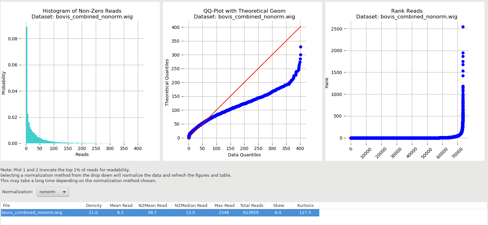

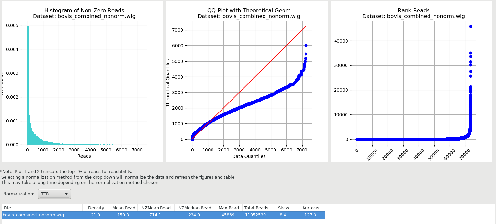

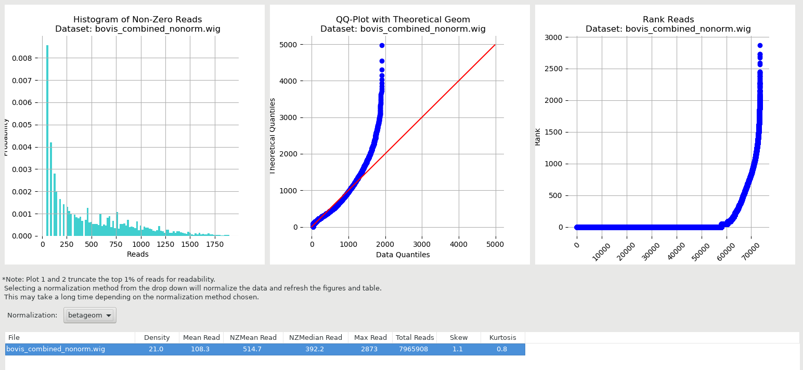


Individual QC plots:

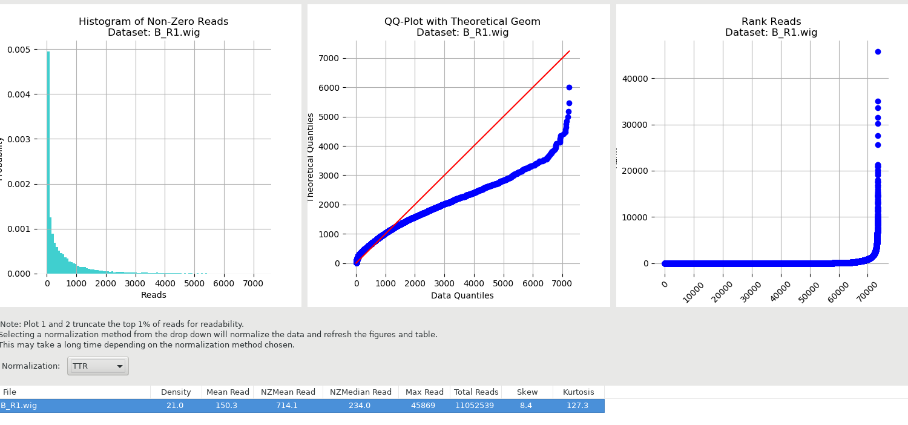

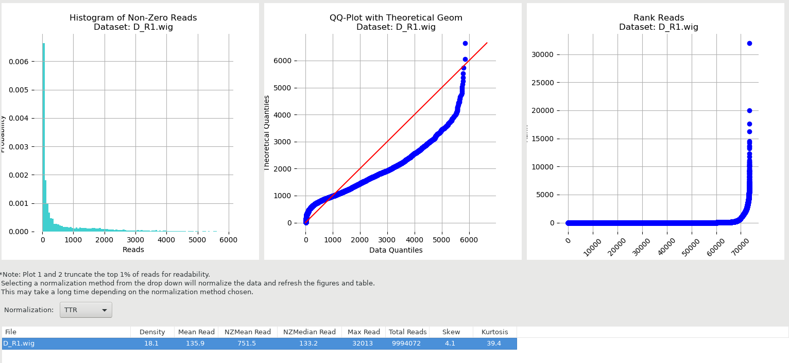


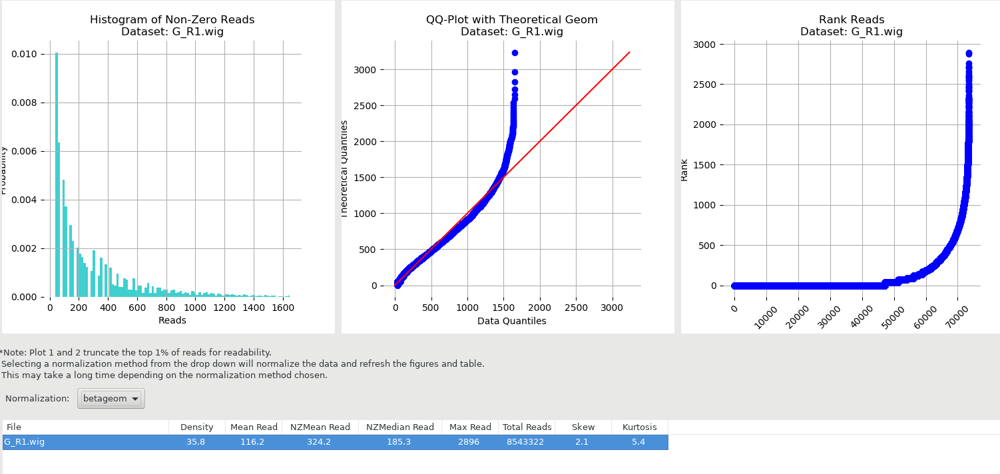

I chose betageom with G because so skewed (similar to combined file)

Ran transit gumbel:

```{bash}
nohup transit gumbel B_R1.wig,D_R1.wig,G_R1.wig $my_path/refseqs/mbovis/mbovis.prot_table $my_path/mbovis/transit/bovis_nonorm.txt -r Sum &>run_tradis_out &

nohup transit gumbel B_R1_TTR.wig,D_R1_TTR.wig,G_R1_TTR.wig $my_path/refseqs/mbovis/mbovis.prot_table $my_path/mbovis/transit/bovis_TTR.txt -r Sum >& run_tradis_TTR_out &
```

-m can use default of read counts of 1, but can make higher to filter out low coverage

Legend for calls: E=Essential U=Uncertain, NE=Non-Essential, S=too short

some weird results--shows 9 insertions in a region (dnaN,  2052 to 3260) that has no reads acc to .wig files (with 35 TA sites in region) (Mb0002, dnaN).

columns in .txt file: "ORF","Name", "Descr", "no ins in ORF", "total TA in ORF", "len max run non-ins", "nt span for max run non-ins", "zbar", "call"


Maybe because prot_table has a mistake in first entry for whole genome? Need to edit prot_table and try again with transit. No real effect, just on first line. Made no difference really, to combined files, either--don't use these for processing, so not going to worry about it.


*Check results with hmm*

bovis_hmm_genes.txt shows call for each gene:


```
#ORF	gene	annotation	TAs	ES sites	GD sites	NE site GA sites	saturation	mean	call

Mb0002	 dnaN	NA	35	0	0	35	0	0.2571	674.11	NE
Mb0002	 dnaN	NA	35	0	0	35	0	0.2571	674.11	NE
```
Also records 35 TA sites, but considers NE: 0 ES sites, 0 GD sites, 35 NE sites

key: ES=essential, GD=insertions cause growth-defect, NE=non-essential, GA=insertions confer growth-advantage, N/A=not analyzed (genes with 0 TA sites)

bovis_hmm.txt shows for each TA site:


```
# Mean:	1053.77
# Median:	288.00
# Normalization:	TTR
# LOESS Correction:	False
# pins (obs):	0.464779
# pins (est):	0.559946
# Run length (r):	6
# State means:
#    ES:   1.0101   GD:   8.5764   NE: 657.6422   GA: 3288.2112
# Self-Transition Prob:
#    ES: -1.2361e-17   GD: -1.2361e-17   NE: -1.2361e-17   GA: -1.2361e-17
# State Emission Parameters (theta):
#    ES: 0.9900   GD: 0.1166   NE: 0.0015   GA: 0.0003
# State Distributions:#    ES: 13.64%   GD: 4.52%   NE: 79.88%   GA: 1.96%
60	0	1.00e+00 	7.86e-20 	9.05e-22 	1.81e-22 	ES	-_( LT708304.1),-_( LT708304.1),Mb0059_( dnaB),Mb0001_( dnaA)
72	0	1.00e+00 	9.26e-21 	1.39e-24 	5.56e-26 	ES	-_( LT708304.1),-_( LT708304.1),Mb0059_( dnaB),Mb0001_( dnaA)
102	0	1.00e+00 	1.09e-21 	2.14e-27 	1.71e-29 	ES	-_( LT708304.1),-_( LT708304.1),Mb0059_( dnaB),Mb0001_( dnaA)
188	0	1.00e+00 	1.28e-22 	3.28e-30 	5.24e-33 	ES	-_( LT708304.1),-_( LT708304.1),Mb0059_( dnaB),Mb0001_( dnaA)
246	0	1.00e+00 	1.51e-23 	5.04e-33 	1.62e-36 	ES	-_( LT708304.1),-_( LT708304.1),Mb0059_( dnaB),Mb0001_( dnaA)
333	0	1.00e+00 	1.78e-24 	7.77e-36 	5.71e-39 	ES	-_( LT708304.1),-_( LT708304.1),Mb0059_( dnaB),Mb0001_( dnaA)
```
From the paper (Dejesus, 2013):
"The resulting state transition model affords a ‘smoothing’ of the read- count data, where, for example, TA sites with no insertions in non-essential regions (e.g. because they are absent from the library) are tolerated because neighboring sites have insertions. However, if a consecutive sequence of TA sites with no insertions is long enough, the most probable state sequence, as determined by the Viterbi algorithm switches locally to essential, providing a different labeling of that region."

[Dejesus, 2013](https://bmcbioinformatics.biomedcentral.com/articles/10.1186/1471-2105-14-303)

**Using BioTradis**

[Biotradis github page](https://github.com/sanger-pathogens/Bio-Tradis#usage)

[biotradis tutorial](BioTraDISTutorial.pdf)

https://www.biostars.org/p/15847/

>Bam files can also have a companion file, called an index file. This file has the same name, suffixed with .bai. This file acts like an external table of contents, and allows programs to jump directly to specific parts of the bam file without reading through all of the sequences. Without the corresponding bam file, your bai file is useless, since it doesn't actually contain any sequence data. If you have a bam file without a corresponding index, you can generate one using "samtools index bamfile.bam"


[BWA docs](http://bio-bwa.sourceforge.net/bwa.shtml)


Dong made a pipeline doc outlining what he's done with mbovis data:

```
#### TraDIS Pipeline

Programs needed:

Samtools
bwa
bio-tradis
bamtools
trimmomatic (if required to trim)

** also need bedtools


Need 4 files in addition to FASTQs:

Reference fasta file
Tradis_pipeline_make_BAMs.sh
TraDIS_summary.R
names.txt (text file with names of FASTQs in rows (without .fastq.gz))

## Index reference fasta

bwa index ref.fasta

## Run shell script to remove tags and create aligned BAMs (need to specify tag sequence and reference file name

tag=GTCTAGAGACCGGGGACTTATCAGCCAACCTGTTA ref=M.bovis_AF2122.fasta ./Tradis_pipeline_make_BAMs.sh

## move into BAM folder and run R script

cd ..._BAMs (... will be date and time)

Rscript ../TraDIS_summary_Mbovis.R

## to calculate essentialities

TraDIS_summary_Mbovis-LT708304.1_gammaFit.R
```

I have adjusted Tradis_pipeline_make_BAMs.sh script (original stored locally):

```{bash}
module load python/v3 samtools bedtools bwa

```{bash}
#!/bin/bash
# from Dong Xia's tradis pipeline

# usage: bash tradis_pipeline_make_BAMS.sh

ref=/d/in16/u/sj003/refseqs/Mbovis_AF2122_97.fasta
tag=GTCTAGAGACCGGGGACTTATCAGCCAACCTGTTA


# indexes database sequences in FASTA format
bwa index ${ref}

while read i;
do
#gunzip ${i}.fastq.gz
# creates fastq file containing reads that match supplied tag
filter_tradis_tags -f ${i}.fastq -t ${tag} -o ${i}.removed0mis.fastq
# creates fastq file containing reads with supplied tag removed from seqs
remove_tradis_tags -f ${i}.removed0mis.fastq -t ${tag} -o ${i}.removed.fastq

# aln is old way: finds SA coordinates of input reads (what dong uses)
 bwa aln ${ref} ${i}.removed.fastq > ${i}.removed.fastq.sai
# aligns in SAM format
bwa samse ${ref} ${i}.removed.fastq.sai ${i}.removed.fastq > ${i}.sam

# bwa mem for 70bp-1Mbp query seqs with BWA-MEM algorithm using maximal exact matches and extending with SW algorithm (should have more reads) local alignment
# this is what TPP (DeJesus) uses
#bwa mem ${ref} ${i}.removed.fastq > ${i}.sam
# file format conversion
samtools view -bS ${i}.sam > ${i}.bam
# sort alignments by leftmost coordinates
samtools sort ${i}.bam > ${i}.sort.bam
# index sorted bam file for fast random access (output is aln.bam)
samtools index ${i}.sort.bam
# remove redundant files
rm ${i}.sam ${i}.bam ${i}.removed0mis.fastq ${i}.removed.fastq
# rename unmapped reads, sort, convert to fastq format
samtools view -b -f 4 ${i}.sort.bam > ${i}_unmapped.bam
samtools sort ${i}_unmapped.bam > ${i}_unmappedsort.bam
# use bedtools to convert bam files to fastq
bamToFastq -i ${i}_unmappedsort.bam -fq ${i}_unmapped.fastq
# rename mapped reads, sort, convert to fastq format
samtools view -b -F 4 ${i}.sort.bam > ${i}_mapped.bam
samtools sort ${i}_mapped.bam > ${i}_mappedsort.bam
bamToFastq -i ${i}_mappedsort.bam -fq ${i}_mapped.fastq
# remove redundant files
rm ${i}_unmapped.bam ${i}_unmappedsort.bam ${i}_mapped.bam ${i}_mappedsort.bam
done < names.txt

mkdir $(date +"%Y_%m_%d")_BAMs; mv *.bam *.bai $_
mkdir $(date +"%Y_%m_%d")_Mapped_read; mv *_mapped.fastq $_ 
mkdir $(date +"%Y_%m_%d")_Unmapped_reads; mv *_unmapped.fastq $_

```

```{bash}
nohup bash $my_path/my_scripts/tradis_pipeline_make_BAMS.sh ./ >& run_tradis_out &
```

I did this with both aln and mem. I got way better results with mem (not surprisingly, same % mapped as with tpp which uses mem algorithm).

directories for mem results:

```2020_06_03_mem_BAMs 
2020_06_03_mem_Mapped_reads  
2020_06_03_mem_Unmapped_reads```


for multiqc, must generate samtools stats on .bam files (or .sam files in tpp) before running multiqc
```

```{bash}
$my_path/my_scripts/iterate_samstats.sh
```

MultiQC report for bwa aln (default params):


[MultiQC report aln](images/aln_multiqc_report.html)

MultiQc report for bwa mem (default params):


[MultiQC report mem](images/multiqc_mem_report.html)

23/06/20

Run Dong's analysis on .sort.bam files to see how it is working. 
Used TraDIS_summary_Mbovis-LT708304.1.R
Created 'names.txt' in folder with .bams with all three sample names (no extension). Changed name of feature table to match new one created with Dong's annotation script (Annotate_GFF-locusAsName.R)

Run in directory with files:

```{bash}
 R CMD BATCH $my_path/scripts/TraDIS_summary_Mbovis-LT708304.1.R
```

probably should have done 'nohup' because taking a long time!

```{bash}
nohup R CMD BATCH $my_path/scripts/TraDIS_summary_Mbovis-LT708304.1.R >& TraDIS_summary_Mbovis-LT708304.1.Rout &
```

also importing .bam and .bam.bai files to my local computer to run the script on Rstudio so I can see what is going on


-creates summary.csv file for each sample with name and location of site and number of insertion reads

>creates file: .tradis_gene_insert_sites.csv, containing locus tags, gene names, read counts and unique insertion sites per gene, among other useful bits of data

'no. insertion sites' is number of insertion sites per gene/feature (length of 'insertion site' vector  or length of 'pos IS')

'insertion index' = number of insertion sites/gene length

(this normalises number of unique insertions for length of gene)

'insertion site' : unique reads per insertion site per gene (list of number of reads per IS)

contain read counts on each strand for every nucleotide position in the replicon. They can be opened as “user plots” in the Artemis genome browser, and will be used for further analysis. used to calculate: avg coverage, no. reads per insertion site, total no. insertion sites

'No. reads per IS' is number of unique reads per insertion site per feature (long, pasted list of numbers of reads)

```{R}
for (k in 1:ncol(insertionsite)){
  insertionsite[1,k]<-length(which(is.element(reads$pos,a[k])))
  }
summary_stats$`Av.Coverage`[i]<-median(as.numeric(insertionsite[1,]))
```

'avg coverage' = median of the number of reads at each insertion site per feature

'total no. insertion sites' = sum of number of reads per insertion sites per feature

[insertion plot B](B_S1_L001_R1_001_insertion.jpg)

[insertion plot D](D_S2_L001_R1_001_insertion.jpg)

[insertion plot G](G_S3_L001_R1_001_insertion.jpg)


same columns, but 'DP>5' are same but only if 5 or more reads per insertion site. Why 5?
Is this to eliminate small genes/features with few insertion sites, as not fully saturated library?

-uses mean of samples to create insertion plot, taking mean of av index and av dp5 index

[insertion index per gene](insertion.index.jpg)

[average coverage per gene](av_coverage.jpg)


essentially, only 'normalisation' occurring is to look at 'DP>5' counts only, where there are 5 or more reads per insertion site. Similar idea to TTR which is trimming top and bottom 5% of read counts?

** Look at correlation of insertion sites between samples

import .wig files from server and calculate correlation between datasets

see script: correlation_bovis.R

non_normal datasets:

```{R}
res <- cor(non_norm)
round(res, 2)
#     B    D    G
#B 1.00 0.10 0.06
#D 0.10 1.00 0.07
#G 0.06 0.07 1.00
```
```{r}

```


ttr normalised datasets:

```{R}
res_ttr <- cor(ttr_norm)
round(res_ttr, 2)
#     B    D    G
#B 1.00 0.10 0.06
#D 0.10 1.00 0.07
#G 0.06 0.07 1.00
```

so looks like ttr doesn't affect correlation between datasets?

Would we expect correlation between these sub-pools?

It seems to me we shouldn't expect correlation of the positions of the reads among the three 'sub-libraries' given that, for example, B, has only 5,000 colonies plated, vs. D, which has 35,000. I don't know the number of individual mutants in the libraries, but I would imagine it is bigger than 5,000 if you had 300,000 colonies. So B really isn't representative of the entire library--we will have stochastic effects, as only a partial pool of mutants is selected. So I am not sure there is any point in evaluating separately. It seems to me that if you have 35,000 colonies in sub-library D, that should be enough to represent all the independent mutants in the library, according to Long, et al. But adding together should add to genes covered, or at least, to the coverage of certain genes. 

I know this doesn't help with the lack of correlation between the technical replicates. Have we done correlation between this library and Mtb?
 
Sharon says the number of unique TA sites hit (insertions) doesn't correlate to library size. It would seem that you should have fewer genes covered with a smaller library, but that isn't what we are seeing (library 'G' has best coverage, only 2 plates). This is more important than correlation at each position. 


Used wig files generated by tpp to calculate statistics 'manually' for comparison to transit stats and Dong's stats:

```{R}

tn_stats_df<-read.csv("bovis_combined_TTR.wig", header=TRUE, sep = "\t", skip=6, row.names=NULL, col.names = c('position', 'B', 'D', 'G', 'gene'))
View(tn_stats_df[1:50,])

# df for sum of reads for each ta site
comb_names<-c("position", "sum reads", "gene")
combined_df<-as.data.frame(matrix(0, nrow = nrow(tn_stats_df), ncol = 3))
combined_df[,1]<-tn_stats_df[,1]
for (i in 1:nrow(combined_df)){
  combined_df[i,2]<-sum(tn_stats_df[i,2:4])
}
combined_df[,3]<-tn_stats_df[,5]
colnames(combined_df)<-comb_names
View(combined_df[0:200,])

# find raw number of ta sites inserted for TTR normalised (sum of reads is not 0)
tot_count <- combined_df[,2]
ins_count<-0
for (i in 1:length(tot_count)){
  if (tot_count[i] != 0.0){
    ins_count <- ins_count + 1
  }
}
ins_count
# 34178
length(tot_count)
# 73536
insertion_density <- ins_count/length(tot_count)
insertion_density
# 0.4647792

# max read count
max(tot_count)
# 100024.5  (uses normalisation factor?)

# mean of no insertions per gene
mean(tot_count)
# 489.7486


#non zero mean (mean of read counts at all non-zero sites)
# change all zeros to na
is.na(tot_count) <- tot_count==0.0
tot_count[1:100]
mean(tot_count, na.rm=TRUE) 
# 1053.723


# do this again with non_normal

tn_non_stats_df<-read.csv("bovis_combined_nonorm.wig", header=TRUE, sep = "\t", skip=6, row.names=NULL, col.names = c('position', 'B', 'D', 'G', 'gene'))
View(tn_non_stats_df[1:20,])

# df for sum of reads for each ta site
comb_names<-c("position", "sum reads", "gene")
combined_non_df<-as.data.frame(matrix(0, nrow = nrow(tn_non_stats_df), ncol = 3))
combined_non_df[,1]<-tn_non_stats_df[,1]
for (i in 1:nrow(combined_non_df)){
  combined_non_df[i,2]<-sum(tn_non_stats_df[i,2:4])
}
combined_non_df[,3]<-tn_non_stats_df[,5]
colnames(combined_non_df)<-comb_names
View(combined_non_df[0:200,])

# find raw number of ta sites inserted for TTR normalised (sum of reads is not 0)
tot_non_count <- combined_non_df[,2]
ins_non_count<-0
for (i in 1:length(tot_non_count)){
  if (tot_non_count[i] != 0.0){
    ins_non_count <- ins_non_count + 1
  }
}

length(tot_non_count)
# 73535   (why is this one less than ttr?)
# 72450 is what Sharon gets
# 73536 is what I get counting naively

ins_non_count
# 34178  (exactly same as normalised with TTR?)
# same number of sites inserted but number of counts different
max(tot_non_count)
# 5913

mean(tot_non_count)
# 29.54797

#non zero mean 
is.na(tot_non_count) <- tot_non_count==0.0
mean(tot_non_count, na.rm=TRUE) 
# 63.57335
```

# see how this process aligns with one of the dejesus libraries

```{R}
dejesus_40_df<-read.csv("SRR4113440_1.wig", sep = " ", skip=2, header=TRUE, row.names=NULL, col.names=c('position', 'count'))
View(dejesus_40_df[1:50,])

# find raw number of ta sites inserted for TTR normalised (sum of reads is not 0)
tot_40 <- dejesus_40_df[,2]
ins_count_40<-0
for (i in 1:length(tot_40)){
  if (tot_40[i] != 0.0){
    ins_count_40 <- ins_count_40 + 1
  }
}

length(tot_40)
# 74603
ins_count_40
# 39247

#insertion density
id_40<-ins_count_40/length(tot_40)
id_40
# 0.526078

max(tot_40)
# 4121

mean(tot_40)
# 29.79875

#non zero mean 
is.na(tot_40) <- tot_40==0.0
mean(tot_40, na.rm=TRUE) 
# 56.64321
```

These results match the results from the tpp program (even non zero mean).

I'm thinking difference in insertion densities between Dong and tpp must have to do with mapping? he doesn't tell me the parameters he uses for bwa, but default parameters aren't giving me the same number of insertions seen in excel results file.


# noticed in biotradis docs, you can: 
Generate insertion site plot for only reads with a mapping score >= 50
Bio::Tradis::TradisPlot(mappedfile => 'mapped.bam', mapping_score => 50)->plot;

where is mapping score?


** attempt to create own coverage files from .bam files using bedtools

Create Bed file for sorted bam files:
```{bash}
 bamToBed -i B_S1_L001_R1_001.sort.bam > $my_path/mbovis/bed_files/B_S1.bed
 bamToBed -i D_S2_L001_R1_001.sort.bam > $my_path/mbovis/bed_files/D_S2.bed
 bamToBed -i G_S3_L001_R1_001.sort.bam > $my_path/mbovis/bed_files/G_S3.bed
```

this may not be necessary, as Bedtools coverage has option -ibam which uses sorted bam files?

```{bash}
bedtools genomecov [OPTIONS] -i <bed/gff/vcf> -g <genome>
```

```{bash}
genomeCoverageBed –i file.bed -bg –g my.genome > sample.cov
```

```{bash}
bedtools genomecov -bga -ibam /d/in16/u/sj003/mbovis/bwa_mapped/2020_06_03_mem_BAMs/B_S1_L001_R1_001.sort.bam > /d/in16/u/sj003/mbovis/coverage/B1_S1.cov
```

Genome (-g) files are ignored when BAM input is provided.

-d Report the depth at each genome position (with one-based coordinates).
this gives read depth at literally every single nucleotide. I want every ta site.

-bg		Report depth in BedGraph format. For details, see:
			genome.ucsc.edu/goldenPath/help/bedgraph.html
			
-bga		Report depth in BedGraph format, as above (-bg).
			However with this option, regions with zero 
			coverage are also reported. This allows one to
			quickly extract all regions of a genome with 0 
			coverage by applying: "grep -w 0$" to the output.

This only gives reads at genome feature coordinates, not every ta site

[bedtools genome coverage](https://bedtools.readthedocs.io/en/latest/content/tools/genomecov.html)

what about if i use a custom bedfile instead based on TA positions rather than gene coordinates? bedtools coverage compares query bed file a with file b. (can use multiple .bam files). 

-d	Report the depth at each position in each A feature. Positions reported are one based. Each position and depth follow the complete A feature.
One should use the “-d” option to create, for each interval in A, a detailed list of coverage at each of the positions across each A interval.
The output will consist of a line for each one-based position in each A feature, followed by the coverage detected at that position.

-s Calculating coverage by strand
Use the “-s” option if one wants to only count coverage if features in A are on the same strand as the feature / window in A. This is especially useful for RNA-seq experiments.

[bedtools coverage tool](https://bedtools.readthedocs.io/en/latest/content/tools/coverage.html)

```{bash}

bedtools coverage [OPTIONS] -a <FILE> \
                             -b <FILE1, FILE2, ..., FILEN>

```

have to make query .bed file. 3 required columns: chromosome, start and end. for forward strand, if start is 2, end is 3. for reverse strand, if start is 2, end is 1. But for examples, start is lower number? so do I need to convert reverse to other way around where start is A? This looks better. Can I use this in Dong's script with bamparam to map coverage, or better to do myself with bedtools coverage? I think I need to make strand specific?

ex seq: GTAATTATATACG
forward TA's: 2-3,6-7,8-9,10-11
reverse TA's: 5-4, 8-7, 10-9
reverse AT's: 4-5, 7-8, 9-10

LT708304  2 3 +
LT708304  4 5 -
LT708304  6 7 +
LT708304  7 8 -
LT708304  8 9 +
LT708304  9 10 -
LT708304  10  11  +


can i make 'insert_site_plot' with biotradis?

made a python script to count TA sites in fasta sequence. 
This came up with same number of TA sites as TPP: 73536.
Sharon reports 73450.
'insertion_site_finder.py' 

Can I use this instead of feature table to count reads? Do I need to have positions of both forward and reverse strands for mapping purposes? Generate (bedfile?) file with positions of the 5’ end of each TA site for each strand. Is this necessary? The wig files seemed to only have the forward positions listed--every TA is an AT on the other side, so it is the same site.

GRRR! I discovered that I was using truncated features file when running dong's scripts. Re-ran annotation script (Annotate_GFF.R) and used new file (M_bovis_features.csv) with summary script.

I want total insertions in genome--add up insertion sites per gene

Just realised first item in summary.csv files is entire genome! Lists all insertions in genome, and other statistics. 

B:  48040 = no. insertions
    0.0110... = insertion index
    3 = av. coverage
    20597 = no. insertions with read # >5
    0.004735 = insertion index DP>5
    20 = av. covg DP > 5
    
D:  26038 = no. insertions
    0.00598587922859907 = insertion index
    3 = av. covg
    11289 = no insertions with DP >5
    0.00259522968782759 = insertion index DP>5
    30 av. covg DP >5
    
G:  146517 = no. insertions
    0.0336828123103406 = insertion index
    2 = avg covg
    32914 = no insertions with DP>5
    0.00756660376872685 = insertion index DP >5
    10 av covg DP > 5
    
G has a lot of insertions but at very low density (this was library of only two plates). D has best coverage, but low number of insertions.
    
    
I am concerned that my feature file has duplicate positions, like the same genomic positions for ‘gene’ and ‘CDS’ for each feature. So I’ve just counted the number of insertion sites for ‘gene’ only and totalled those, and I get 216,600 insertions. That still seems way too high? I guess this is adding total number of insertions for each sample for each gene feature, so many of those insertions are duplicated by each dataset. I think I need to add up the number of unique positions after I combine the columns of actual insertion positions. Or maybe take from first line only?

13 July

Irilenia has discovered (using gene viewer) that the reverse reads are being recorded with position of 3' end rather than the 5' end position. Therefore, insertions in the same insertion site are recorded with unique positions corresponding to their sheared end. This may inflate number of unique insertions on reverse strand.

there also seem to be a lot of duplicates (with same ta position and same genomic suffix). Even without paired end reads, should be able to use tool (Picard) to remove duplicates? I'm not sure this would work, however, as it uses 5' read position and so many map to same exact position but may be unique reads with different read length.

To further confirm over-estimation in unique insertion counts in Dong's script:

Looking at .csv from Sharon (BCD_bothBatch_TraDIS_summary)

MB1985c	CDS	CONSERVED HYPOTHETICAL PROTEIN	2196042	2196233	192	18	0.09375	12.5	12	0.0625	18.5	2195926;2195927;2195933;2195953;2196003;2196013;2196033;2196045;2196051;2196053;2196056;2196096;2196119;2196121;2196131;2196171;2196174;2196182	1,84,2,18,14,32,1,203,1,8,4,11,14,9,19,19,48,4	492

This has 18 insertions in gene length of 192. Every 10 nt? Hard to believe. Look at list of insertion sites:
2195926;2195927;2195933;2195953;2196003;2196013;2196033;2196045;2196051;2196053;2196056;2196096;2196119;2196121;2196131;2196171;2196174;2196182

I can't find TA sites at/near some of these insertion sites.

The 47,881 unique mutants Sharon quotes from Dong (in slack message) relates to sum of unique insertion sites column in excel file which is missing chunk of genome? In 'BCD_bothBatch_TraDIS_summary' (a file emailed to Irilenia for visualisation help), number is 55,818. I'm not sure whether these represent all insertions, as do not show insertions in intergenic regions?


Attempted to run biotradis from thoth.

```{bash}
module load python/v3
module load perl
```

```
bacteria_tradis -f file.list -t GTCTAGAGACCGGGGACTTATCAGCCAACCTGTTA -r /d/in16/u/sj003/refseqs/mbovis/Mbovis_AF2122_97.fasta -mm 1
There was a problem filtering '/d/in16/u/sj003/mbovis/biotradis/G_S3_L001_R1_001.fastq' by 'GTCTAGAGACCGGGGACTTATCAGCCAACCTGTTA'; it looks like the tag was not found in any read
None of the input files contained the specified tag.  Please check that your inputs are valid fastq files and that at least one read in one of them starts with the specified tag
```

so i tried with tag on 5' end (3' is default):
```
thoth.cryst.bbk.ac.uk> bacteria_tradis -f file.list -t GTCTAGAGACCGGGGACTTATCAGCCAACCTGTTA -r /d/in16/u/sj003/refseqs/mbovis/Mbovis_AF2122_97.fasta -td 5 -mm 1
There was a problem filtering '/d/in16/u/sj003/mbovis/biotradis/G_S3_L001_R1_001.fastq' by 'GTCTAGAGACCGGGGACTTATCAGCCAACCTGTTA'; it looks like the tag was not found in any read
None of the input files contained the specified tag.  Please check that your inputs are valid fastq files and that at least one read in one of them starts with the specified tag
thoth.cryst.bbk.ac.uk> head -50 G_S3_L001_R1_001.fastq
@M01637:39:000000000-CDG9B:1:1101:14529:1617 1:N:0:AGTGGT
GTCTAGAGACCGGGGACTTATCAGCCAACCTGTTACTAGATCGGAAGAGCACACGTCTGAACTCCAGTCACAGTGGTCAATCTCGTATGCCGTCTTCTGCTTGTAATAAATTATTTTTTTTTTTTTTTTTTTTTTTTTTTTTTTTTTTTTT
```

This is so weird because tag exists on each read. Tried it with shorter tag and got same error. Tried command from tutorial:

```{bash}
bacteria_tradis -v -m 0 -f fastqs.txt -t GTCTAGAGACCGGGGACTTATCAGCCAACCTGTTA -r /d/in16/u/sj003/refseqs/mbovis/Mbovis_AF2122_97.fasta
```

still same error. 
```{bash}
grep 'GTCTAGAGACCGGGGACTTATCAGCCAACCTGTTA' G_S3_L001_R1_001.fastq | wc -l
1336702
```

so clearly there. sequence in fastq format. not sure what problem is?

Tried with mtb data:

```{bash}
bacteria_tradis -v -f fastqs.txt -t GTCTAGAGACCGGGGACTTATCAGCCAACCTGTTA -r /d/in16/u/sj003/refseqs/Mtb/Mtb_H37Rv.fasta
```

same error

made tag much shorter:

```{bash}
bacteria_tradis -v -f fastqs.txt -t AGCCAACCTGTTA -r /d/in16/u/sj003/refseqs/Mtb/Mtb_H37Rv.fasta
```

success!(?)

fastqs.stats file:

```
File,Total Reads,Reads Matched,% Matched,Reads Mapped,% Mapped,Unique Insertion Sites : NC_000962.3,Seq Len/UIS : NC_000962.3,Total Unique Insertion Sites,Total Seq Len/Total UIS
SRR4113440_1.fastq,3832963,5,0.000130447384960408,3,60,3,1470510.66666667,3,1470510.66666667
```

lol, that didn't exactly work!

tried filter_tradis_tags command:

```{bash}
filter_tradis_tags -f  G_S3_L001_R1_001.fastq -t GTCTAGAGACCGGGGACTTATCAGCCAACCTGTTA -o G_S3.tag.fastq
```

this seemed to work--so if all reads have tag, what is the problem?
Continuing to try to bypass, use remove tags command:

```{bash}
remove_tradis_tags -f G_S3.tag.fastq -t GTCTAGAGACCGGGGACTTATCAGCCAACCTGTTA -o G_S3.rmtag.fastq
```

do same for B and D samples

then run biotradis without tag indicated:

```{bash}
bacteria_tradis -v -m 0 -f bovis_fastqs.txt -r /d/in16/u/sj003/refseqs/mbovis/Mbovis_AF2122_97.fasta
```

(files must be in same directory as running biotradis)

(-m 0 means no minimum mapping score, not sure if this is what I want, but don't remember seeing a minimum in LHSTM script, relates to multi-mappers?)

(also, bwa mem is default mapper)

```
File,Total Reads,Reads Matched,% Matched,Reads Mapped,% Mapped,Unique Insertion Sites : LT708304.1,Seq Len/UIS : LT708304.1,Total Unique Insertion Sites,Total Seq Len/Total UIS
G_S3.rmtag.fastq,1336530,1336530,100,1104853,82.6657837833793,146043,29.7850906924673,146043,29.7850906924673
D_S2.rmtag.fastq,867830,867830,100,774437,89.23833008769,26584,163.628648811315,26584,163.628648811315
B_S1.rmtag.fastq,912988,912988,100,746319,81.7446669616687,48361,89.9465271603151,48361,89.9465271603151

```

unique ins sites (UIS): 146043, 26584, 48,361
seq len/ UIS: 29.785, 163.6286, 89.946527

not sure if these stats make sense? Ran from raw fastq instead of trimmed (.rmtag.fastq). Ran again.


```{R}
library(dplyr)
data<-read.csv("results/bovis_fastqs.stats", header=T)
bovis_stats <- select(data, 1, 7, 8)
bovis_stats
```

tried this with one of the dejesus samples, the transposon tag had more mismatches in it so it was more complicated.

```{bash}
filter_tradis_tags -f SRR4113440_1.fastq -t TCGGGGACTTATCAGCCAACCTGTTA -m 2 -o SRR4113440_1.tag.fastq
```

```{bash}
bacteria_tradis -v -m 0 -f fastqs.txt -r /d/in16/u/sj003/refseqs/Mtb/Mtb_H37Rv.fasta
```

Statistics were comparable to mbovis samples--more 'unique insertion sites' than TA 'hits' in transit analysis

```
File,Total Reads,Reads Matched,% Matched,Reads Mapped,% Mapped,Unique Insertion Sites : NC_000962.3,Seq Len/UIS : NC_000962.3,Total Unique Insertion Sites,Total Seq Len/Total UIS
SRR4113440_1.rmtag.fastq,805785,805785,100,542913,67.3769057502932,130631,33.7709425787141,130631,33.7709425787141
```

Total unique insertion sites for biotradis on this Mtb library is 130631. Transit finds 39247. Way too many.


After Irilenia contacted and they tried to fix bug:

```
File,Total Reads,Reads Matched,% Matched,Reads Mapped,% Mapped,Unique Insertion Sites : LT708304.1,Seq Len/UIS : LT708304.1,Total Unique Insertion Sites,Total Seq Len/Total UIS
G_S3.rmtag.fastq,1336530,1336530,100,1104853,82.6657837833793,49029,88.7210426482286,49029,88.7210426482286
D_S2.rmtag.fastq,867830,867830,100,774437,89.23833008769,19949,218.051230638127,19949,218.051230638127
B_S1.rmtag.fastq,912988,912988,100,746319,81.7446669616687,26934,161.502339051014,26934,161.502339051014
```

Same exact mapping coordinates, but number of unique insertions is much less!

```{R}
library(dplyr)
data<-read.csv("results/new_bovis_fastqs.stats", header=T)
bovis_stats <- select(data, 1, 7, 8)
bovis_stats
```

These values are 54-67% higher than transit counts. Does biotradis count insertions on each strand as unique insertions? It would appear so. For Mtb sample SRR4113440, found 62241 unique insertions after bug fixed. Transit found 39,247 (63% of biotradis).

Trying to count number of unique insertions on each strand from insertion plot file:

```{bash}
grep -c '^[^ ] [^0]' <SRR4113440_1.rmtag.out.NC_000962.3.insert_site_plot
```

number of non-zero rows in 2nd column (reverse?): 22763

```{bash}
grep -c '^[^ ] [^0]' <SRR4113440_1.rmtag.out.NC_000962.3.insert_site_plot
```

number of non-zero rows in 1st column (fwd?): 32569

total: 55,332 (53,219 is total of gene-level insertions in csv summary file below, does this include intergenic regions?)

If 73536 forward TAs total, and each can be either fwd or reverse insertion, then double this, 147,072 possible sites. Then using max number of insertions above, 55,332/147072 = 0.376 insertion density?

Can use biotradis commands to convert insertion plot to .csv summary file:

```{bash}
nohup tradis_gene_insert_sites -o m_bovis_BDG.csv -trim3 0.1 -j $my_path/refseqs/mbovis/LT708304_updated_aug19.gff D_S2.rmtag.out.LT708304.1.insert_site_plot.gz G_S3.rmtag.out.LT708304.1.insert_site_plot.gz B_S1.rmtag.out.LT708304.1.insert_site_plot.gz &>run_tradisinsert_out &

```

(-trim3 trims reads from 3' end where reads are more likely tolerated/-trim5 from start, fraction of gene length trimmed, -j for joined plots in one output file)

```
MSG: EMBL stream with no ID. Not embl in my book
```

need to use different annotation file. This could be weird?
downloaded from ena:
```{bash}
curl "https://www.ebi.ac.uk/ena/data/view/LT708304&display=txt&expanded=true" > LT708304.embl
```

ran again with LT708304.embl annotation file (this appears to have complete genome), and this worked.

Next step is to run essentiality R script.

```{bash}
tradis_essentiality.R joined_output.m_bovis_BDG.csv
```

Compare HMM gene output to Sharon's group's calls:

tnseq_compare.R

```{r}
essential_genes_custom <- bovis_custom[bovis_custom$Call == 'ES',]

essential_genes_custom$Name

```


664 'essential' genes using Sharon's scripts (essential changepoint = 0.0045)

286 'ambiguous' (ambiguous changepoint = 0.0072)

3050 'non-essential'

4000 total genes


Using HMM:

499 'essential' genes ()

173 'growth disadvantage' genes (disadvantage to disruption)

58  'growth advantage' genes (advantage to disruption)

3376 'non-essential' genes 

4122 total

More genes in HMM--includes some non-coding elements such as tRNA

133 essential genes in common between two approaches
```
> common_ess
  [1] "MB0001" "MB0004" "MB0005" "MB0013" "MB0123" "MB0230" "MB0290"
  [8] "MB0291" "MB0292" "MB0293" "MB0294" "MB0295" "MB0296" "MB0297"
 [15] "MB0298" "MB0299" "MB0355" "MB0358" "MB0423" "MB0424" "MB0523"
 [22] "MB0524" "MB0537" "MB0538" "MB0539" "MB0540" "MB0541" "MB0570"
 [29] "MB0572" "MB0654" "MB0658" "MB0669" "MB0686" "MB0701" "MB0703"
 [36] "MB0720" "MB0721" "MB0722" "MB0723" "MB0724" "MB0725" "MB0726"
 [43] "MB0727" "MB0735" "MB0736" "MB0737" "MB0738" "MB0739" "MB0740"
 [50] "MB0741" "MB0742" "MB0753" "MB0811" "MB0970" "MB0976" "MB1051"
 [57] "MB1052" "MB1316" "MB1324" "MB1325" "MB1326" "MB1327" "MB1328"
 [64] "MB1336" "MB1337" "MB1338" "MB1339" "MB1340" "MB1341" "MB1342"
 [71] "MB1348" "MB1415" "MB1416" "MB1417" "MB1418" "MB1419" "MB1424"
 [78] "MB1426" "MB1450" "MB1471" "MB1472" "MB1495" "MB1496" "MB1497"
 [85] "MB1498" "MB1519" "MB1520" "MB1620" "MB1625" "MB1626" "MB1627"
 [92] "MB1628" "MB1631" "MB1636" "MB1637" "MB1638" "MB1639" "MB1655"
 [99] "MB1676" "MB1680" "MB1681" "MB1686" "MB1719" "MB1725" "MB1738"
[106] "MB1739" "MB1811" "MB1822" "MB2162" "MB2216" "MB2217" "MB2218"
[113] "MB2266" "MB2267" "MB2268" "MB2269" "MB2412" "MB2435" "MB3007"
[120] "MB3056" "MB3057" "MB3308" "MB3493" "MB3580" "MB3659" "MB3669"
[127] "MB3739" "MB3810" "MB3811" "MB3819" "MB3820" "MB3821" "MB3823"
> length(common_ess)
[1] 133
```

Compared with biotradis, as well. Had 531 genes called 'essential'.

Made Venn diagram using https://bioinfogp.cnb.csic.es/tools/venny/


Added in Gumbel method. Gumbel has only 362 genes labelled essential. Has other calls for 'short' and 'uncertain'. This is using ALL insertions, even those with only one read. The essential genes caled are mostly a subset of those called by HMM method.

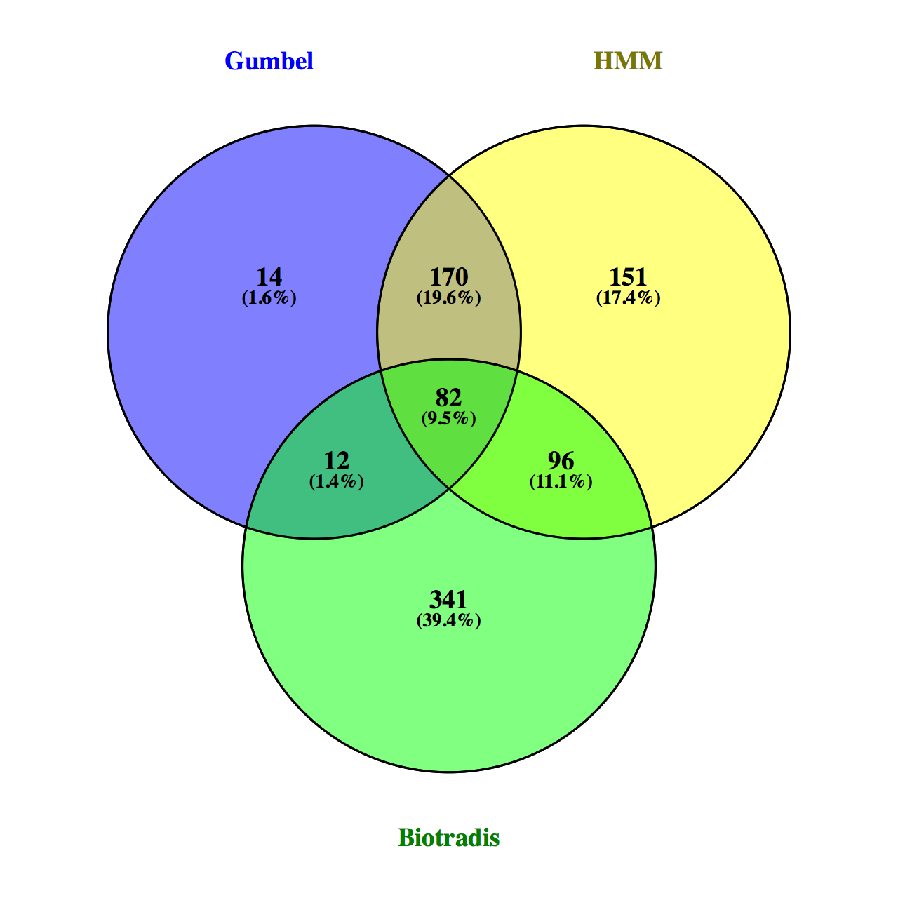

Spreadsheet of all tools: results/tnseq_compare.txt


# Check out new bovis libraries bcg

downloaded from dropbox on 5 August

Checked that R1 and R2 all the same length for each sample

Number of reads seems really low? (divide by 4 = 140-150,000+). I think you need round about 1M reads.

610016 Mbovis2_B_S1_R1.fastq
610016 Mbovis2_B_S1_R2.fastq
588224 Mbovis2_C_S2_R1.fastq
588224 Mbovis2_C_S2_R2.fastq
574884 Mbovis2_D_S3_R1.fastq
574884 Mbovis2_D_S3_R2.fastq

Run FastQC

I'm a little concerned about the duplication. How much is normal for tn seq? Without paired end sequencing, it is hard to separate jackpot events from legitimate overrepresented mutants (with growth advantage from insertion? Is this really common? See Chao 2016)

compare B sample overrepresented in mbovis1 and 2:

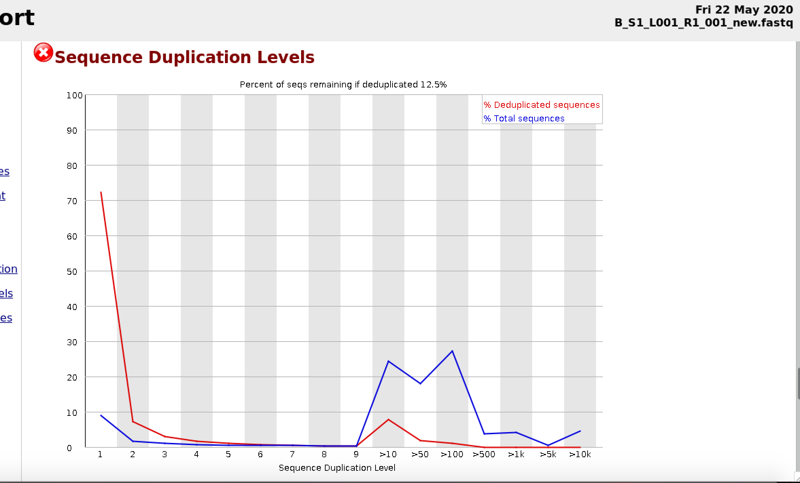

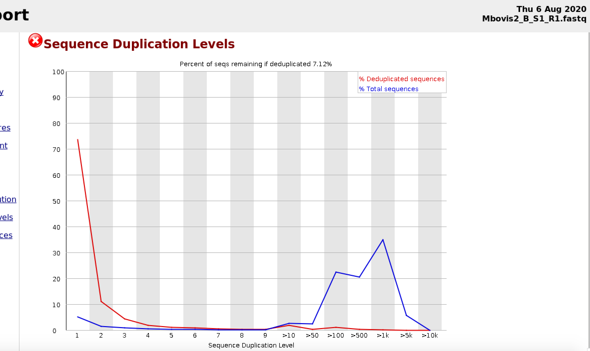

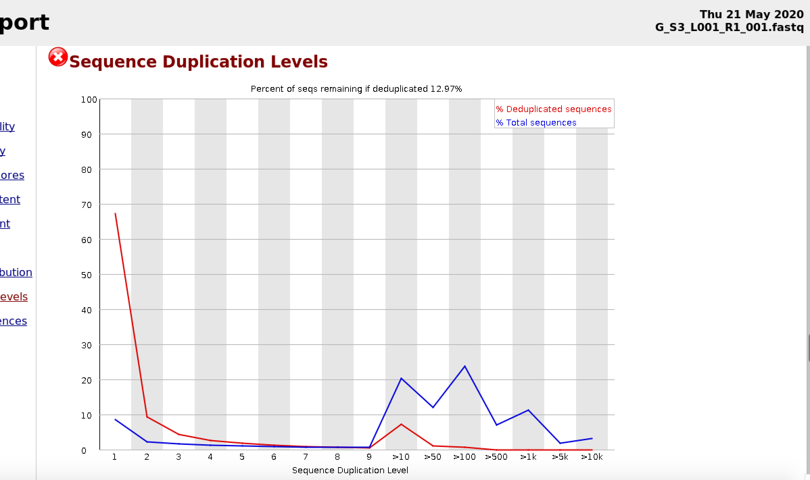

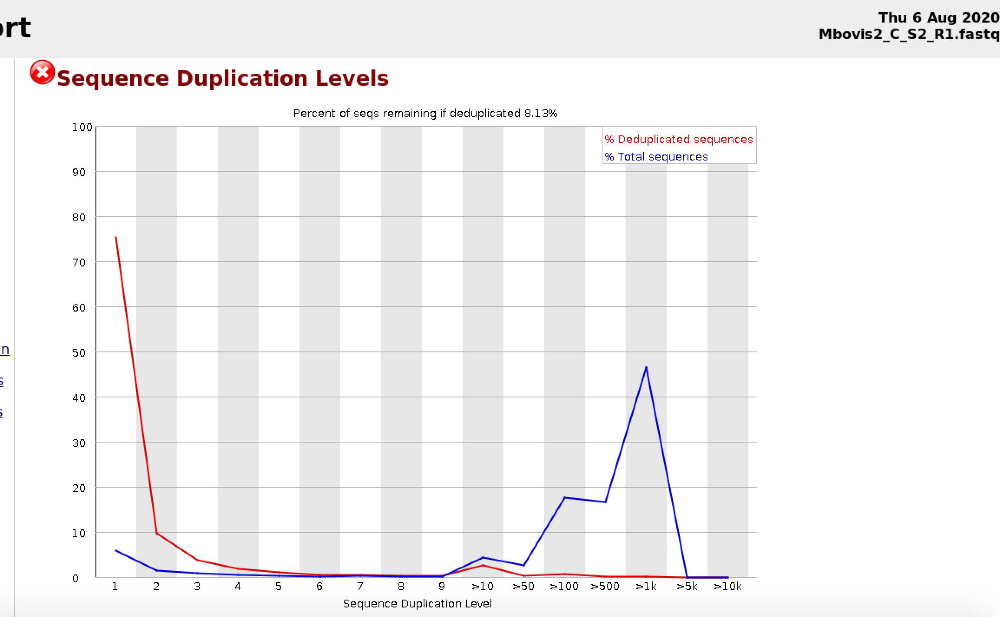


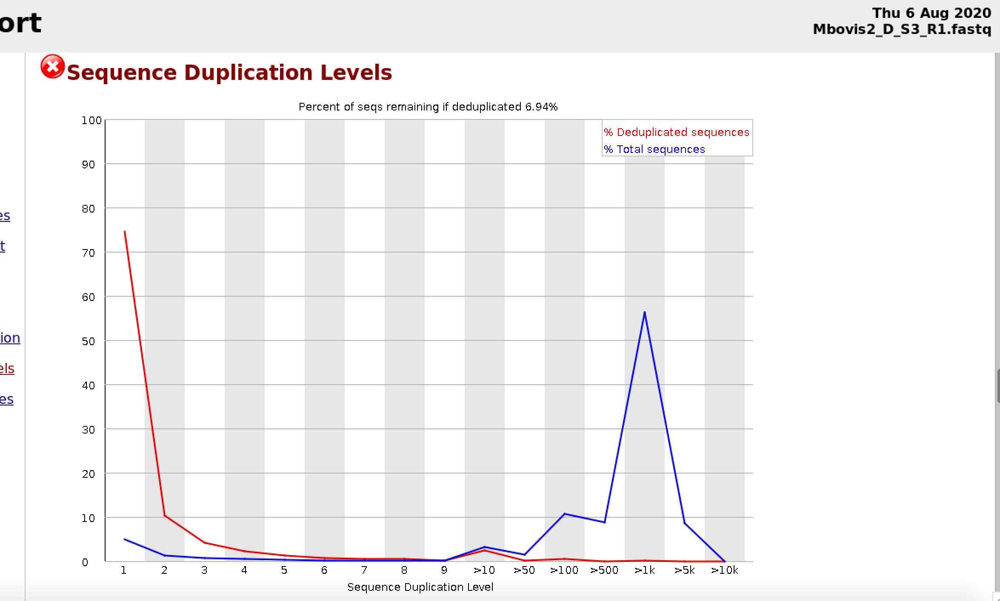

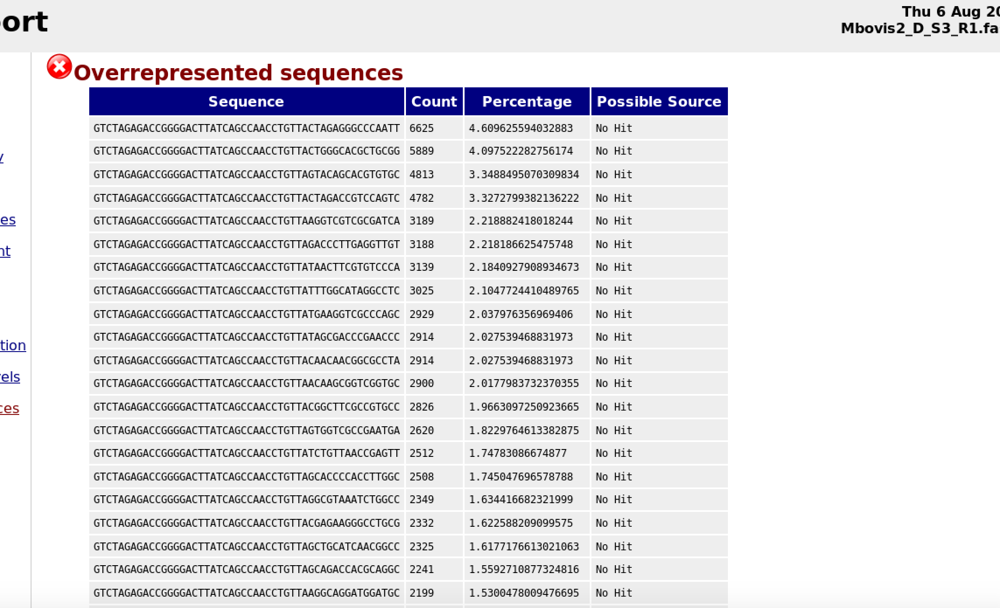


Other considerations including similar distribution of read counts in Solaimanpour et al, 2015:

>Additional challenges were posed by strong biases observed in the distribution of mapped sequence reads. If every unique transposon insertion (or unique mutant) had an equal chance to yield a sequence read the distribution ofnumber ofreads per unique insertion should be similar to a normal distribution, although it could be skewed to some extent by selection against insertions in essential genes and presence of insertion “hot spots” [14]. In reality, the distribution resembles a power law distribution, which is indicative of strong biases in how likely different mutants are to be detected by the high-throughput sequencing. For example, one ofour mutant libraries was represented by 2,593,856 sequence reads which could be reliably mapped to the genome but all these reads were mapped to only 23,962 unique insertions (defined by a position in the genome and the orientation ofthe transposon)—an average of 108 reads per unique insertion. In one extreme, this library included nine insertions represented by >5000 reads and 256 insertions represented by >1000 reads, whereas 5679 (24%) unique insertions were represented by a single read and 7843 (33%) by 3 or fewer reads. We considered a scenario where positive selection could lead to proliferation of some specific mutants that outcompete other mutants and the wild-type strain in the culture but the genes that contained the insertions represented by high numbers of reads also contained other insertions that were represented by normal or low numbers of reads, arguing that this scenario cannot fully explain the observed data. We believe that this bias in distribution ofreads per unique insertion could be an artifact of the experimental procedures in the preparation of the samples for sequencing, which involves amplification and enrichment for transposon-chromosome junctions, or it could arise from other processes that we do not fully understand


This is disregarded, as read counts don't matter, but count unique insertions, instead (like biotradis and transit). Does this really solve problem entirely? 

[MultiQC Report mbovis 2](data/mbovis2_multiqc_report.html)

Shows duplication levels consistently at over 91%! 

original mbovis samples show between 87-88.3%
[MultiQC Report mbovis 1](data/mbovis1_multiqc_report.html)


How does this compare with DeJesus? Sequence duplicates range from 4.6% to 77.7%. This is before their de-duplication with paired end. 


Run TPP on new bovis samples to see statistics:

Really poor insertion statistics. It looks like insertions just didn't work. Very few templates (around 10^5) and very few insertion sites. Sample C is typical:

*mbovis2_C*
total_reads (or read pairs): 147056
trimmed_reads (reads with valid Tn prefix, and insert size>20bp): 111275
reads1_mapped: 104104
reads2_mapped: 0
mapped_reads (both R1 and R2 map into genome, and R2 has a proper barcode): 104104 
read_count (TA sites only, for Himar1): 89974
template_count: 89974
TA_sites: 73536
TAs_hit: 524
density: 0.007
max_count (among templates): 3668
max_site (coordinate): 2898642
NZ_mean (among templates): 171.7

Mtb had much larger read counts (for Mtb1 anyway, Mtb2 a little light):
6936952 Mtb1_S4_R1.fastq  (1.7M)
6936952 Mtb1_S4_R2.fastq
2721576 Mtb2_S5_R1.fastq (680K)
2721576 Mtb2_S5_R2.fastq


[MultiQC report Mtb](data/mtb_kendall_multiqc_report.html)

High duplication levels (over 90% in both). In Mtb1, one sequence had 7% of reads! GTCTAGAGACCGGGGACTTATCAGCCAACCTGTTACTAGACCGTCCAGTC	121557

Same sequence had highest number of reads in Mtb2?
GTCTAGAGACCGGGGACTTATCAGCCAACCTGTTACTAGACCGTCCAGTC	50972	7.491541665564363

What is this sequence? beginning is the transposon sequence, but last (CTAGACCGTCCAGTC)? is this an adaptor from other end?

What about mbovis?
Same sequence is number 2 in B,C and 4th in D

Seems to be product of phage contamination.

mbovis2 B:
GTCTAGAGACCGGGGACTTATCAGCCAACCTGTTACTAGAGGGCCCAATT	8836	5.793946388291454	No Hit
GTCTAGAGACCGGGGACTTATCAGCCAACCTGTTACTAGACCGTCCAGTC	3951	2.590751717987725	No Hit
GTCTAGAGACCGGGGACTTATCAGCCAACCTGTTACCCGTCGGCGCCGTT	3579	2.3468236898704293	No Hit
GTCTAGAGACCGGGGACTTATCAGCCAACCTGTTAGTAGAGGTCCCGGTA	3377	2.2143681477207156	No Hit
GTCTAGAGACCGGGGACTTATCAGCCAACCTGTTAACGTGCTCGGGTTGC	3239	2.123878717935267	No Hit

mbovis2 C:
GTCTAGAGACCGGGGACTTATCAGCACAAAACAGCGGAGAGAACAACATG	3855	2.6214503318463716	No Hit
GTCTAGAGACCGGGGACTTATCAGCCAACCTGTTACTAGACCGTCCAGTC	3699	2.5153682950712652	No Hit
GTCTAGAGACCGGGGACTTATCAGCTGGCATGAGCTGGGCAAGTACTACA	3396	2.3093243390273095	No Hit
GTCTAGAGACCGGGGACTTATCAGCCAACCTGTTATATCCGGCGTGACCG	3380	2.298444130127298	No Hit
GTCTAGAGACCGGGGACTTATCAGCCAACCTGTTATGGCAAGACGGTGCA	3308	2.2494831900772496	No Hit
GTCTAGAGACCGGGGACTTATCAGCGTAGACGTAGCCATACAGGGTGCCG	3181	2.163121531933413	No Hit
GTCTAGAGACCGGGGACTTATCAGCCAACCTGTTACAGTCGCGGGGACCG	3142	2.1366010227396366	No Hit

mbovis2 D
GTCTAGAGACCGGGGACTTATCAGCCAACCTGTTACTAGAGGGCCCAATT	6625	4.609625594032883	No Hit
GTCTAGAGACCGGGGACTTATCAGCCAACCTGTTACTGGGCACGCTGCGG	5889	4.097522282756174	No Hit
GTCTAGAGACCGGGGACTTATCAGCCAACCTGTTAGTACAGCACGTGTGC	4813	3.3488495070309834	No Hit
GTCTAGAGACCGGGGACTTATCAGCCAACCTGTTACTAGACCGTCCAGTC	4782	3.3272799382136222	No Hit
GTCTAGAGACCGGGGACTTATCAGCCAACCTGTTAAGGTCGTCGCGATCA	3189	2.218882418018244	No Hit
GTCTAGAGACCGGGGACTTATCAGCCAACCTGTTAGACCCTTGAGGTTGT	3188	2.218186625475748	No Hit
GTCTAGAGACCGGGGACTTATCAGCCAACCTGTTATAACTTCGTGTCCCA	3139	2.1840927908934673	No Hit
GTCTAGAGACCGGGGACTTATCAGCCAACCTGTTATTTGGCATAGGCCTC	3025	2.1047724410489765	No Hit
GTCTAGAGACCGGGGACTTATCAGCCAACCTGTTATGAAGGTCGCCCAGC	2929	2.037976356969406	No Hit
GTCTAGAGACCGGGGACTTATCAGCCAACCTGTTATAGCGACCCGAACCC	2914	2.027539468831973	No Hit


I've done a blast search with some of the overrepresented sequences (first grep to get entire read, as 15nt bit after transposon tag really isn't long enough)

```{bash}
grep -m 10 -e GTCTAGAGACCGGGGACTTATCAGCCAACCTGTTAAGATCGGAAGAGCAC $my_path/mtb/Mtb1_S4_R1.fastq
```

then copy whole read after gtta and do blastn search. First hit was 'Himar1-delivery and mutagenesis vector pHBurk5'. but checked loads of other ones, and they are from various other phages/vectors. esp human gamma herpesvirus. But such a short sequence, probably lots of hits.

Sharon says this is what happened when they had lots of phage contamination. She will send me sequenced phiX phage and we can compare, but probably a problem with library construction (shearing DNA)?

Got PhiX sequence from ncbi. Not exact but nearly:

Illumina uses NC_001422

http://www.ncbi.nlm.nih.gov/nucleotide/NC_001422


>Feb 2, 2011
>There are 5 single-nucleotide differences between the PhiX sequence from NCBI and the PhiX sequence from Illumina. Both sequences have length of 5386 bp. The difference are (in 1-based coordinates):

| Position | NCBI | Illumina |
| -------- | ---- | -------- |
| 587 | G | A |
| 833 | G | A |
| 2731 | A | G |
| 2793 | C | T |
| 2811 | C | T |

>The Illumina Phix sequence is used by RTA to report initial error rates. Note that in practice some sites in PhiX are heterozygous.

from: https://www.biostars.org/p/50124/

#B bovis 2 sample B duplicated sequences

Sequence	Count	Percentage	Possible Source
GTCTAGAGACCGGGGACTTATCAGCCAACCTGTTACTAGAGGGCCCAATT	8836	5.793946388291454	No Hit

-seems to be phage from Sharon's list

GTCTAGAGACCGGGGACTTATCAGCCAACCTGTTACTAGACCGTCCAGTC	3951	2.590751717987725	No Hit

```{bash}
grep -c -e CTAGACCGTCCAGTC Mbovis2_B_S1_R1.fastq
grep -m 10 -e CTAGACCGTCCAGTC Mbovis2_B_S1_R1.fastq
```

sequence repeated 4275 when grep sample. Check full read seqs to see if in phage sequencing reads?

```{bash}
grep -c -e ATATACATATGGAAAAAAAGGAATTTCGTGTTTTGATAAAATACTGTTTT Mbovis2_B_S1_R1.fastq
```

3710

This sequence appeared in phage sequence reads (795)
```{bash}
grep -c -e ATATACATATGGAAAAAAAGGAATTTCGTGTTTTGATAAAATACTGTTTT $my_path/mbovis/21768_MycomarT7phagemid_1_trimmed.fastq
```


other overrepresented seqs from B:

GTCTAGAGACCGGGGACTTATCAGCCAACCTGTTACCCGTCGGCGCCGTT	3579	2.3468236898704293	No Hit
GTCTAGAGACCGGGGACTTATCAGCCAACCTGTTAGTAGAGGTCCCGGTA	3377	2.2143681477207156	No Hit
GTCTAGAGACCGGGGACTTATCAGCCAACCTGTTAACGTGCTCGGGTTGC	3239	2.123878717935267	No Hit
GTCTAGAGACCGGGGACTTATCAGCCAACCTGTTATCGCCATGTAAGCCC	2614	1.7140534018779834	No Hit
GTCTAGAGACCGGGGACTTATCAGCCAACCTGTTATGTCAGGAGCTGGCC	2592	1.6996275507527672	No Hit
GTCTAGAGACCGGGGACTTATCAGCCAACCTGTTAGCCCGCGTCGAAGTA	2481	1.6268425746209938	No Hit
GTCTAGAGACCGGGGACTTATCAGCCAACCTGTTACAACGAGCCGCGGGG	2215	1.4524209201070135	No Hit
GTCTAGAGACCGGGGACTTATCAGCCAACCTGTTACGACCGGACCGCTGA	1809	1.186198394796202	No Hit
GTCTAGAGACCGGGGACTTATCAGCCAACCTGTTATTCCTCGTAGAACGC	1749	1.146855164454703	No Hit
GTCTAGAGACCGGGGACTTATCAGCCAACCTGTTATATGGCTGGATCTTT	1731	1.135052195352253	No Hit
GTCTAGAGACCGGGGACTTATCAGCCAACCTGTTACATCACCGAGGGCCA	1713	1.1232492262498033	No Hit
GTCTAGAGACCGGGGACTTATCAGCCAACCTGTTATCGTCGCGGCCCTGG	1677	1.0996432880449036	No Hit
GTCTAGAGACCGGGGACTTATCAGCCAACCTGTTACGGTTGTGCGAGTCG	1651	1.0825945548969207	No Hit
GTCTAGAGACCGGGGACTTATCAGCCAACCTGTTAGGGCACGTTCGCGAA	1567	1.0275140324188219	No Hit
GTCTAGAGACCGGGGACTTATCAGCCAACCTGTTAGTCGCCGTGGCTGAA	1514	0.9927608456171642	No Hit
GTCTAGAGACCGGGGACTTATCAGCCAACCTGTTATGACCTACGACCGGT	1416	0.9285002360593821	No Hit
GTCTAGAGACCGGGGACTTATCAGCCAACCTGTTACATGAACGCCACCGT	1391	0.9121072234170907	No Hit
GTCTAGAGACCGGGGACTTATCAGCCAACCTGTTACGCCGTGCGCGCGTT	1391	0.9121072234170907	No Hit


#check some from C as those seemed to be from mycobacteria

Overrepresented sequences	fail
Sequence	Count	Percentage	Possible Source
GTCTAGAGACCGGGGACTTATCAGCACAAAACAGCGGAGAGAACAACATG	3855	2.6214503318463716	No Hit

```{bash}
grep -c -e ACAAAACAGCGGAGAGAACAACATG $my_path/mbovis/21768_MycomarT7phagemid_1_trimmed.fastq
```

0 hits. This sequence was positive for mycobacteria when I blasted.

GTCTAGAGACCGGGGACTTATCAGCCAACCTGTTACTAGACCGTCCAGTC	3699	2.5153682950712652	No Hit

```{bash}
grep -c -e CTAGACCGTCCAGTC $my_path/mbovis/21768_MycomarT7phagemid_1_trimmed.fastq
```
796 hits in phage seqs, also positive for bovis

GTCTAGAGACCGGGGACTTATCAGCTGGCATGAGCTGGGCAAGTACTACA	3396	2.3093243390273095	No Hit

```{bash}
grep -c -e TGGCATGAGCTGGGCAAGTACTACA $my_path/mbovis/21768_MycomarT7phagemid_1_trimmed.fastq
```
no hits in phage seqs

(had mycobacterium hits when I blasted)

GTCTAGAGACCGGGGACTTATCAGCCAACCTGTTATATCCGGCGTGACCG	3380	2.298444130127298	No Hit
GTCTAGAGACCGGGGACTTATCAGCCAACCTGTTATGGCAAGACGGTGCA	3308	2.2494831900772496	No Hit
GTCTAGAGACCGGGGACTTATCAGCGTAGACGTAGCCATACAGGGTGCCG	3181	2.163121531933413	No Hit
GTCTAGAGACCGGGGACTTATCAGCCAACCTGTTACAGTCGCGGGGACCG	3142	2.1366010227396366	No Hit
GTCTAGAGACCGGGGACTTATCAGCCAACCTGTTACGTGGCCGCGTTCAA	2902	1.9733978892394735	No Hit
GTCTAGAGACCGGGGACTTATCAGCCAACCTGTTACAGCGTGCCAACCGC	2721	1.8503155260581001	No Hit
GTCTAGAGACCGGGGACTTATCAGCCAACCTGTTATGCGCCACCGTGACA	2395	1.6286312697203784	No Hit
GTCTAGAGACCGGGGACTTATCAGCCAACCTGTTATATGCACGGTACTTC	2139	1.4545479273202047	No Hit
GTCTAGAGACCGGGGACTTATCAGCCAACCTGTTAGAGTCGAGGACATGC	2128	1.4470677837014472	No Hit
GTCTAGAGACCGGGGACTTATCAGCCAACCTGTTACAACTATCCGGCGAT	2096	1.4253073659014253	No Hit
GTCTAGAGACCGGGGACTTATCAGCCAACCTGTTACAACTTCGGTAGCGG	2040	1.3872266347513873	No Hit
GTCTAGAGACCGGGGACTTATCAGCCAACCTGTTAAGCTGAGCACCACGC	2039	1.3865466216951365	No Hit


GTCTAGAGACCGGGGACTTATCAGCCAACCTGTTATGTATCGAATGGCCA	1837	1.2491839843324992	No Hit

also none in phage seq reads. Mycobacteria hits with blast


GTCTAGAGACCGGGGACTTATCAGCCAACCTGTTACGTGCGCGACGTGCC	1763	1.198863018169949	No Hit
GTCTAGAGACCGGGGACTTATCAGCCAACCTGTTATTCGGTCTTGACCCG	1725	1.173022522032423	No Hit
GTCTAGAGACCGGGGACTTATCAGCCAACCTGTTACGCCAGCAAGTCGCT	1655	1.1254216080948753	No Hit
GTCTAGAGACCGGGGACTTATCAGCCAACCTGTTACATATGCCAGGACTT	1639	1.1145413991948645	No Hit
GTCTAGAGACCGGGGACTTATCAGCCAACCTGTTAGCCCGCGATCTCGGA	1611	1.0955010336198456	No Hit
GTCTAGAGACCGGGGACTTATCAGCCAACCTGTTATCACCTACTCGACCA	1605	1.0914209552823415	No Hit
GTCTAGAGACCGGGGACTTATCAGCCAACCTGTTACCTGCTGTCGATGGA	1387	0.9431781090196931	No Hit
GTCTAGAGACCGGGGACTTATCAGCCAACCTGTTATGATGACAGGCTTCG	1364	0.9275378087259275	N

so two different phages--one sequenced by Sharon, 'mycomar phage T7' and also PhiX phage for control. No PhiX contamination in samples of mbovis, but lots of T7 phage in B and D. c had lots of mycobacterial overrep sequences, so maybe PCR event? But sequencing/read count is so low, who knows what it is doing to proportions.


#comparing mbovis and mtb (dejesus) transit gene calls

10 August: Spoke to Irilenia. Might be interesting to see how Transit results compare for m bovis and mtb.

First run Transit hmm on all libraries in DeJesus paper (14). Use comma separated list and take 'mean' of reads with 'TTR' normalisation (these are default settings for transit hmm). Use results in /tpp_results/paired_end.

```{bash}
nohup transit hmm $my_path/dejesus_mtb/tpp_results/paired_end/pe_SRR4113427.wig,$my_path/dejesus_mtb/tpp_results/paired_end/pe_SRR4113428.wig,$my_path/dejesus_mtb/tpp_results/paired_end/pe_SRR4113429.wig,$my_path/dejesus_mtb/tpp_results/paired_end/pe_SRR4113430.wig,$my_path/dejesus_mtb/tpp_results/paired_end/pe_SRR4113431.wig,$my_path/dejesus_mtb/tpp_results/paired_end/pe_SRR4113432.wig,$my_path/dejesus_mtb/tpp_results/paired_end/pe_SRR4113433.wig,$my_path/dejesus_mtb/tpp_results/paired_end/pe_SRR4113434.wig,$my_path/dejesus_mtb/tpp_results/paired_end/pe_SRR4113435.wig,$my_path/dejesus_mtb/tpp_results/paired_end/pe_SRR4113436.wig,$my_path/dejesus_mtb/tpp_results/paired_end/pe_SRR4113437.wig,$my_path/dejesus_mtb/tpp_results/paired_end/pe_SRR4113438.wig,$my_path/dejesus_mtb/tpp_results/paired_end/pe_SRR4113439.wig,$my_path/dejesus_mtb/tpp_results/paired_end/pe_SRR4113440.wig $my_path/refseqs/Mtb/mtbH37Rv.prot_table dejesus-Mtb.txt &>run_transit_out &
```


need to compare genes.txt files to see what genes present in both lists.

tnseq_compare.R

[compare gene names for mtb and bovis](results/comp_mtb_bovis.txt)

13 September

Redo this using list of orthologous ORFS in bovis and mtb (supplied by Sharon)

```{R tnseq_compare.R}
library(dplyr)

mtb_genes<-read.delim("results/dejesus-Mtb_genes.txt", sep="\t", header=FALSE, stringsAsFactors=F, skip=4)
head(mtb_genes)

mtb_hmm <- select(mtb_genes, 1, 2, 11)
colnames(mtb_hmm) <- c("ORF","gene","call")
View(mtb_hmm)
length(mtb_hmm$call)

bovis_hmm <- select(hmm_results, 1, 2, 11)
colnames(bovis_hmm) <- c("ORF","gene", "call")
# have to trim whitespace before gene to compare with mtb
bovis_hmm$gene<-trimws(bovis_hmm$gene)
View(bovis_hmm)
length(bovis_hmm$call)

#this calls two for each gene, have to ask for 'unique'
# get rid of extra lines 
bovis_hmm<-unique(bovis_hmm)
# order
bovis_hmm<-bovis_hmm[order(bovis_hmm$ORF),]
# remove all but MB orf names
# put into df1 all rows where pedigree_dhl starts with CCB133$
p1 <- 'Mb'
bovis_hmm <- subset(bovis_hmm, grepl(p1, bovis_hmm$ORF) )
# remove any hyphens after the orf name
for (i in 1:nrow(bovis_hmm)){
  bovis_hmm$ORF[i]<-sub("\\s-$", "", bovis_hmm$ORF[i], ignore.case=TRUE)
}
View(bovis_hmm)
length(bovis_hmm$gene)

# read in ortholog file
orthologs<-read.delim("data/mb_mtb_orthologs_1.txt", sep=",", header=FALSE, stringsAsFactors=F, skip=1)
colnames(orthologs)<-c("bovis", "mtb", "v/i")
View(orthologs)
nrow(orthologs)

# make table with orf names, calls in bovis and mtb
comp_calls<-as.data.frame(matrix(0, nrow = length(orthologs$bovis), ncol = 5))
colnames(comp_calls)<-c("bovis", "mt", "v/i", "mb_call", "mt_call")
head(comp_calls)

for (i in 1:nrow(orthologs)){
  #if (orthologs$bovis[i] %in% bovis_hmm$ORF){
  comp_calls$bovis[i]   <- orthologs$bovis[i]
  comp_calls$mt[i]      <- orthologs$mtb[i]
  comp_calls$`v/i`[i]   <- orthologs$`v/i`[i]
  if (orthologs$bovis[i] %in% bovis_hmm$ORF){
    comp_calls$mb_call[i] <- bovis_hmm[which(bovis_hmm$ORF == orthologs$bovis[i]),3]
  }else{
    comp_calls$mb_call[i] <- "N/A"
    }
  if (orthologs$mtb[i] %in% mtb_hmm$ORF){
    comp_calls$mt_call[i] <- mtb_hmm[which(mtb_hmm$ORF == orthologs$mtb[i]),3]
  }else{
    comp_calls$mt_call[i] <- "N/A"
    }
}
View(comp_calls)

# write table
write.table(comp_calls, file = 'results/comp_orfs.txt', quote = FALSE, sep = '\t', row.names=FALSE)
```

[Table of essentiality calls for mtb and bovis](results/comp_orfs.txt)


After speaking with Sharon, worked on including information from Malone, 2018 transcriptomics paper in a spreadsheet with essentiality calls.

[Malone, 2018](https://www.microbiologyresearch.org/content/journal/mgen/10.1099/mgen.0.000163#html_fulltext)

```{R}
#pull in malone tables of functional categories

library(dplyr)

# get info from sheet 3 including orf pairs, gene names, functional categories, identical
malone_df<-read.delim("data/Malone_orthologs.csv", sep=",", header=FALSE, stringsAsFactors=F, skip=3)
head(malone_df)
malone_3<-select(malone_df, 2,3,4,6,11)
head(malone_3)
# remove duplicates (36 duplicates based on mbovis orf name)
malone_3<-malone_3[!duplicated(malone_3$V3), ]

# make dataframe for complete comparison based on mbovis ORFs
bovis_mtb_df<-as.data.frame(matrix(0, nrow = length(bovis_hmm$gene), ncol = 8))
colnames(bovis_mtb_df)<-c("Mbovis", "Mtb", "gene", "func_cat", "i/v", "alteration", "ess_bovis", "ess_mtb")
head(bovis_mtb_df)

bovis_mtb_df$Mbovis    <- bovis_hmm$ORF
bovis_mtb_df$gene      <- bovis_hmm$gene
bovis_mtb_df$ess_bovis <- bovis_hmm$call
head(bovis_mtb_df)

for (i in 1:nrow(bovis_mtb_df)){
  if (bovis_mtb_df$Mbovis[i] %in% malone_3$V3){
    bovis_mtb_df$Mtb[i]    <- malone_3[which(malone_3$V3 == bovis_mtb_df$Mbovis[i]), 1]
    bovis_mtb_df$`i/v`[i]  <- malone_3[which(malone_3$V3 == bovis_mtb_df$Mbovis[i]), 5]
  }else{
    bovis_mtb_df$Mtb[i]    <- ""
    bovis_mtb_df$`i/v`[i]  <- ""
  }
  if (bovis_mtb_df$Mtb[i] %in% mtb_hmm$ORF){
    bovis_mtb_df$ess_mtb[i] <- mtb_hmm[which(mtb_hmm$ORF == bovis_mtb_df$Mtb[i]), 3]
  }
  if (bovis_mtb_df$Mbovis[i] %in% malone_3$V3){
    bovis_mtb_df$func_cat[i] <- malone_3[which(malone_3$V3 == bovis_mtb_df$Mbovis[i]), 4]
  }else{
    bovis_mtb_df$func_cat[i]    <- ""
  }
}

View(bovis_mtb_df)

# work on getting alteration from other sheets
# column 2 is mbovis name, 13 is alteration
#need to do for each of 9(?) sheets

filenames <- list.files("data/Malone", pattern="*.csv", full.names=TRUE)
filenames

for (i in 1:9){
    temp<-read.delim(filenames[i], sep=",", header=FALSE, stringsAsFactors=F, skip=1)
    malone_temp<-select(temp, 2, 13)
    for (j in 1:nrow(malone_temp)){
      if (malone_temp$V2[j] %in% bovis_mtb_df$Mbovis){
          bovis_mtb_df[which(bovis_mtb_df$Mbovis == malone_temp$V2[j]), 6] <- malone_temp$V13[j]
      }
    }
}

for (i in 1:nrow(bovis_mtb_df)){
  if (bovis_mtb_df$alteration[i] == 0){
      bovis_mtb_df$alteration[i] <- ""
  }
}

View(bovis_mtb_df)

#write table
write.table(bovis_mtb_df, file = 'results/full_compare.csv', quote = FALSE, sep = '\t', row.names=FALSE)
```

New file is 'full_compare.csv'


How does the published results of essential genes in Dejesus compare with my replicated results?

Download table S3 from DeJesus, 2017
Compare ORFs and call between my hmm results and published results

```{R}
#compare Dejesus published results with mtb_hmm calls
# get info from sheet 3 including orf pairs, gene names, functional categories, identical
temp_df<-read.delim("data/DeJesus_ORF_ess_calls.csv", sep=",", header=FALSE, stringsAsFactors=F, skip = 4)
dejesus_df<-select(temp_df, 1, 13)

mtb_compare<-as.data.frame(matrix(0, nrow = nrow(dejesus_df), ncol = 3))
colnames(mtb_compare)<-c("ORF", "dejesus_call", "mtb_call")

head(mtb_compare)
mtb_compare$ORF<-dejesus_df[,1]
mtb_compare$dejesus_call<-dejesus_df[,2]

head(mtb_hmm)

for (i in 1:nrow(mtb_compare)){
  if (mtb_compare$ORF[i] %in% mtb_hmm$ORF){
    mtb_compare$mtb_call[i] <- mtb_hmm[which(mtb_hmm$ORF == mtb_compare$ORF[i]), 3]
  }else{
    mtb_compare$mtb_call[i] <- ""
  }
  # n/a is not analysed, therefore same as uncertain in paper?
  if (mtb_compare$dejesus_call[i] == "Uncertain"){
    mtb_compare$dejesus_call[i] <- "N/A"
  }
}
View(mtb_compare)

length(which(mtb_compare$dejesus_call=="ESD"))

## list orfs with different calls
ess_diff<-NULL
for (i in 1:nrow(mtb_compare)){
  if (mtb_compare$dejesus_call[i] != mtb_compare$mtb_call[i]){
    ess_diff<-c(ess_diff, mtb_compare$ORF[i])
  }
}
length(ess_diff)
#402 differences are these down to terminology?
length(which(mtb_compare$dejesus_call=="ESD"))
# 29 are ESD which is an essential domain within ORF
length(which(mtb_compare$mtb_call==""))
# 134 orfs not annotated in our file (are these new novel regions?)
length(which(mtb_compare$dejesus_call=="N/A"))
length(which(mtb_compare$mtb_call=="N/A"))
#76 are uncertain in dejesus paper, only 5 in our analysis (same 5)
length(which(mtb_compare$mtb_call=="N/A" & mtb_compare$dejesus_call=="N/A"))
# 11 ESD calls in paper are ES in our analysis
length(which(mtb_compare$dejesus_call=="ESD" & mtb_compare$mtb_call=="ES"))
```
