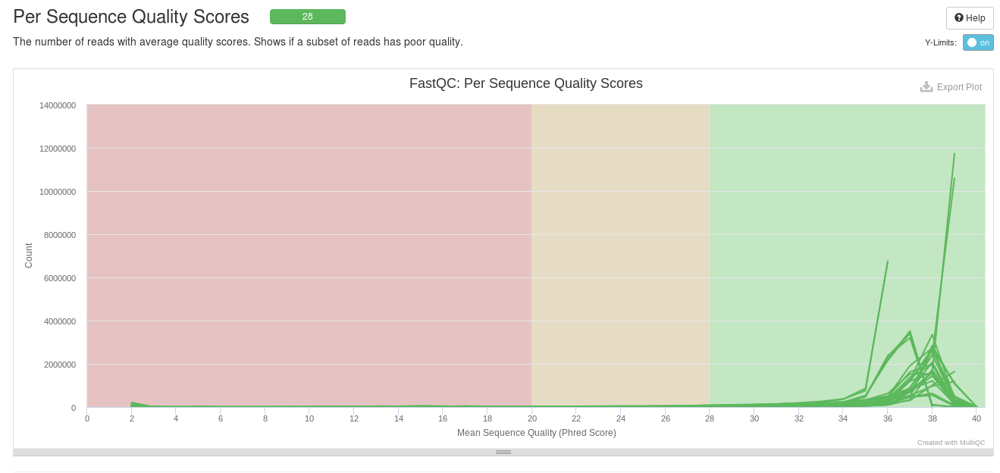
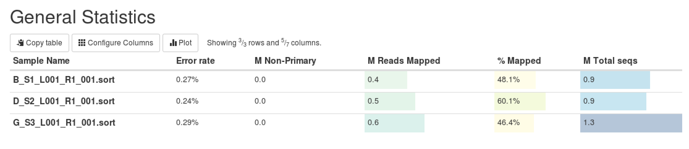
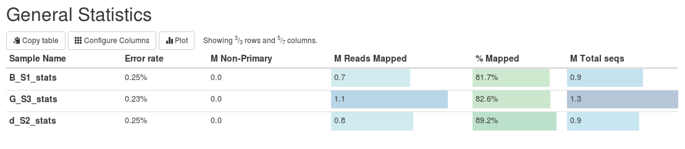

*****
# READING and RESOURCES

1. Galaxy toolkit pipeline
[Essential genes detection with Transposon insertion sequencing](https://galaxyproject.github.io/training-material/topics/genome-annotation/tutorials/tnseq/tutorial.html#count-the-number-of-insertion-per-ta-sites)

2. DeJesus paper on saturated Mtb libraries
[DeJesus et al, 2017. Comprehensive Essentiality Analysis of the Mycobacterium Tuberculosis Genome via Saturating Transposon Mutagenesis](https://pubmed.ncbi.nlm.nih.gov/28096490/)
\cite{Dejesus2017}

3. TRANSIT 
[DeJesus, M.A., Ambadipudi, C., Baker, R., Sassetti, C., and Ioerger, T.R. (2015). TRANSIT - a Software Tool for Himar1 TnSeq Analysis. PLOS Computational Biology, 11(10):e1004401](https://journals.plos.org/ploscompbiol/article?id=10.1371/journal.pcbi.1004401)

4. Transit HMM
[DeJesus, M.A., Ioerger, T.R. A Hidden Markov Model for identifying essential and growth-defect regions in bacterial genomes from transposon insertion sequencing data. BMC Bioinformatics. 2013. 14:303](http://www.ncbi.nlm.nih.gov/pubmed/24103077)

5. Re-sampling
[Subramaniyam S, DeJesus MA, Zaveri A, Smith CM, Baker RE, Ehrt S, Schnappinger D, Sassetti CM, Ioerger TR. (2019). Statistical analysis of variability in TnSeq data across conditions using Zero-Inflated Negative Binomial regression. *BMC Bioinformatics*. 2019 Nov 21;20(1):603. doi: 10.1186/s12859-019-3156-z.](https://www.ncbi.nlm.nih.gov/pmc/articles/PMC6873424/)

6. Tn-seq of M tb
[Zhang YJ, Ioerger TR, Huttenhower C, et al. Global assessment of genomic regions required for growth in Mycobacterium tuberculosis. PLoS Pathog. 2012;8(9):e1002946. doi:10.1371/journal.ppat.1002946](https://pubmed.ncbi.nlm.nih.gov/23028335/)

7. Tn-seq ncRNA
[A comparison of dense transposon insertion libraries in the Salmonella serovars Typhi and Typhimurium](https://www.ncbi.nlm.nih.gov/pmc/articles/PMC3632133/)

8. Transit docs
[Transit/tpp docs](https://transit.readthedocs.io/en/latest/transit_running.html)

9. BioTraDIS docs
[BioTraDIS git hub](https://github.com/sanger-pathogens/Bio-Tradis)

10. Tn-seq methods and protocols:  Long, J. E. et al. Global Phenotypic Profiling. in Gene Essentiality: Methods and Protocols 1279, 79–95 (2015).

**********
# Project Directory Organisation


```{bash}
bash -l
alias rm="rm -i"
cd /d/in16/u/sj003
my_path=$(echo $PWD)
```

### Directory for Mycobacteria project: /d/in16/u/sj003/

```
ls $my_path/
bin  dejesus_mtb  mbovis  ncbi  refseqs  scripts
```

bin: has 'bs' for Illumina basespace downloading

ncbi: has SRA files and configs for downloading with sra toolkit

dejesus_mtb:  contains all library sequence files and analysis for dejesus Mtb project
```
ls $my_path/dejesus_Mtb/
data  fastqc  multiqc  tpp_results  transit_results
```

mbovis: contains all library sequence files and analysis for mbovis project
```
ls $my_path/mbovis/
biotradis                                   MbovisTradis_61826796.json
B_S1_L001_R1_001.fastq.gz_13779964920.json  misc_data
B_S1_L001_R1_001.fastq.gz_14200555041.json  multiqc
bwa_mapped                                  tpp.cfg
data                                        tpp_results
fastqc                                      transit
Mbovis_SampleSheet.csv
```

refseqs: Mtb and mbovis folders contain all reference sequences and annotation files
```
ls $my_path/refseqs/
mbovis  Mtb
```

scripts: mainly bash scripts and parsers. will i put customised analysis scripts in here later??

To transfer local files to thoth (from local terminal):
```{bash}
scp ~/path-to-file/file-to-be-moved sj003@ssh.cryst.bbk.ac.uk:/d/in16/u/sj003/
```

To transfer thoth files to local (on local terminal):
```{bash}
~ jenstiens$ scp sj003@ssh.cryst.bbk.ac.uk:/d/in16/u/sj003/mbovis/bwa_mapped/2020_06_03_BAMs/multiqc_report.html /Users/jenstiens/Tn_seq_project/aln_multiqc_report.html
```


*************************************************************

# Data acquisition

## Downloading mbovis sequencing data from Illumina Basespace:
Install the 'bs' program in a 'bin' directory:
```{bash}
wget "https://api.bintray.com/content/basespace/BaseSpaceCLI-EarlyAccess-BIN/latest/1.1.0/amd64-linux/bs?bt_package=latest" -O $my_path/bin/bs
```

Change permissions
```{bash}
chmod u+x $my_path/bin/bs
```

Authenticate:
```{bash}
 ./bs auth
```

```
Please go to this URL to authenticate:  https://basespace.illumina.com/oauth/device?code=aZsUH
Welcome, Jennifer Stiens
```


Download data:
```{bash}
./bs download project --name MbovisTradis -o $my_path/MbovisTradis/
./bs contents project --name "MbovisTradis"
./bs download file --id "14200555041"
```


**Illumina basespace header info**

[MiSeq reporter software](https://emea.support.illumina.com/content/dam/illumina-support/documents/documentation/software_documentation/miseqreporter/miseq-reporter-software-guide-15042295-05.pdf)

first line of fastq file:
```@M01637:39:000000000-CDG9B:1:1101:16320:1637 1:N:0:ATGCCT```

```@<instrument>:<run number>:<flowcell ID>:<lane>:<tile>:<x-pos>:<y-pos> <read>:<is filtered>:<control number>:<sample number>```

[FASTQ Files BaseSpace](https://help.basespace.illumina.com/articles/descriptive/fastq-files/)

The R1 data from B library downloaded from basespace was wrong somehow. Reads are only 60bp long vs 151bp. Received new R1 data files from Ian at LSHTM and uploaded locally. These matched in length, but sequence headers lacked index. 

**Used bash scripting to edit and add index to headers:**

print number of times string appears in file:
```{bash}
grep -o 'N:0:AAACAT' B_S1_L001_R1_001.fastq | wc -l
```
edit headers of all reads:
```{bash}
awk '{if ($0 ~/^@M/) print substr($0, 1, length($0)-1)"AAACAT"; else print $0}' B_S1_L001_R1_001.fastq > B_S1_L001_R1_001_edited.fastq
```

(one of the seqs has adapter added on to quality b/c of @ symbol, found where problem was by using commands below)

print longest line:
```{bash}
 awk '{ if (length($0) > max) {max = length($0); maxline = $0} } END { print maxline }' B_S1_L001_R1_001.fastq
```
find line number of file that has the string from above:
(has adapter added on to quality b/c of @ symbol--changed awk script to '@M' to stop this from happening)
```{bash}
grep -n "@BBBBFFFFFBBGGGGGGGFGGHGHHHHGGHHHHHHFHHGFHHFFHHHHHHHGGGGECGHHCG?EGCEEGGG?EEEGGGGGGGGHHHHGGGHHEHHGDGGGGHHHGGGGGG?EEEGEGHGEFFHEFGHCCDCC?BGBF??-@DFFFF00BAAACAT" B_S1_L001_R1_001.fastq
```

After fixing the index sequence in header, R1 and R2 from B library still won't pair up properly. In some reads, the y-coordinates are different by one. Used the commands below to eliminate a couple of these reads:

how to print only the sequence from read file:
```{bash}
sed -n ‘2~4p' file
```
print selected lines (like one sequencing read):
```{bash}
sed -n ‘9321,9324p’ file
sed -n ‘9321,+3p’ file
## without -n will print all other lines except for indicated lines
```
delete selected lines and print remaining lines to file:
```{bash}
sed '9321,+3d' B_S1_L001_R1_001.fastq > B_S1_L001_R1_001_edited.fastq
```

Unfortunately, more discrepancies kept popping up. Means we can't use paired reads for this library unless we try to get another copy. However, as these reads are already de-duplicated by the Illumina MiSeq software and do not contain barcodes, there is no further need for the R2. (See email from Ian: unlikely to map with certainty to particular TA site except for reads with some of transposon tag sequenced.)

It seems that the reads are not barcoded (but as adapters are trimmed in MiSeq processing, can't know for sure), so there is no way to 'de-duplicate' the data as specified in DeJesus, etc, using a unique barcode and genomic suffix combination. 


## Downloading Mycobacterium sequences (gff and feature tables)

**16/06/2020 UPDATE**

must use .gff file "LT708304_updated_aug19.gff" because there was a mistake in the NCBI uploaded sequence. This is file Dong has given me to use from Stephen Gordon's group who re-annotated genome https://www.microbiologyresearch.org/content/journal/acmi/10.1099/acmi.0.000129?crawler=true

**from NCBI/Genbank to BBK server (08/06/2020):**

There are two assemblies, but should be quite similar? v2 is from 2020
https://ftp.ncbi.nih.gov/genomes/all/GCA/000/195/835/

to download latest version:

```{bash}
wget ftp://ftp.ncbi.nih.gov/genomes/all/GCA/000/195/835/GCA_000195835.2_ASM19583v2/GCA_000195835.2_ASM19583v2_genomic.gff.gz 
```

**Downloading Mycobacterium sequences (gff and feature tables) from Ensembl to bbk server:**
ftp://ftp.ensemblgenomes.org/pub/bacteria/release-47/gff3/bacteria_4_collection/mycobacterium_bovis_af2122_97/
(must use chrome as ftp not working on safari)
Could only download v1? But there was a v1.46 and a v1.47.Chromosome.chromosome. These were identical (used diff)

```{bash}
wget ftp://ftp.ensemblgenomes.org/pub/bacteria/release-47/gff3/bacteria_4_collection/mycobacterium_bovis_af2122_97/Mycobacterium_bovis_af2122_97.ASM19583v1.46.gff3.gz
```

List of all mbovis sequence and annotation files:
thoth.cryst.bbk.ac.uk> ls mbovis

These are downloaded via ftp from Genbank (above)
GCA_000195835.2_ASM19583v2_feature_table.txt.gz
GCA_000195835.2_ASM19583v2_genomic.gff.gz

'protein table' made using gff_to_prot in tpp:
```{bash}
convert gff_to_prot_table <.gff> <.prot_table>
```

```
LT708304.prot_table
LT708304_updated_aug19.gff

Mbovis_AF2122_97.fasta
Mbovis_AF2122_97.fasta.amb
Mbovis_AF2122_97.fasta.ann
Mbovis_AF2122_97.fasta.bwt
Mbovis_AF2122_97.fasta.pac
Mbovis_AF2122_97.fasta.sa
mbovis_ASM19583v2_feature_table.txt
mbovis_ASM19583v2.gff
mbovis_ASM19583v2.prot_table
Mycobacterium_bovis_af2122_97.ASM19583v1.46.gff3
Mycobacterium_bovis_af2122_97.ASM19583v1.47.chromosome.Chromosome.gff3
```

## Downloading DeJesus Mtb data from NCBI using SRA toolkit

'All TnSeq data sets are publicly available on the NCBI Sequence Read Archive
with accession number SRP083947 and BioProject accession number PRJNA341349.'

There are 14 different libraries, each with two reads.

```{bash}
module load ncbi-sra/v2.10.5 (in /s/software/modules)
```

to get accession list and metadata for deJesus files from NCBI website:

[ncbi link for accession SRP083947](https://www.ncbi.nlm.nih.gov/Traces/study/?acc=SRP083947&o=acc_s%3Aa)

1. download 'Accession list' (SRR_Acc_List.txt.csv)
2. transfer to ncbi/SRA folder

Table of Libraries and Accession numbers:

| Run Acc | SRA Acc | Lib No | Lib Name |
|---------|---------|--------|----------|
| SRR4113427 | SRX2084320 | 1 | WX-WT1 |
| SRR4113428 | SRX2084321 | 2 | WX-WT2 |
| SRR4113429 | SRX2084322 | 11 | SWP-WT7 |
| SRR4113430 | SRX2084323 | 12 | CB-WT |
| SRR4113431 | SRX2084324 | 13 | TraCS-053 |
| SRR4113432 | SRX2084325 | 14 | TraCS-054 |
| SRR4113433 | SRX2084326 | 3 | WX-WT3 |
| SRR4113434 | SRX2084327 | 4 | WX-WT2 |
| SRR4113435 | SRX2084328 | 5 | SWP-WT1 |
| SRR4113436 | SRX2084329 | 6 | SWP-WT2 |
| SRR4113437 | SRX2084330 | 7 | SWP-WT3 |
| SRR4113438 | SRX2084331 | 8 | SWP-WT4 |
| SRR4113439 | SRX2084332 | 9 | SWP-WT5 |
| SRR4113440 | SRX2084333 | 10 | SWP-WT6 |


to get a single library file from NCBI:

```{bash}
./prefetch SRR4113427
```


download from .csv accession list:

```{bash}
./prefetch $my_path/ncbi/SRR_Acc_List.txt.csv
```


script to perform validation step and fasterq-dump on each sra read file to convert .sra files to .fastq files and put in appropriate directory:

```{bash}
#!/bin/bash

#assign all files ending in .sra to FILES variable
FILES=*.sra

#Loop over FILES and assign each to file

for file in $FILES
do
	filename=$file
	echo “File on the loop:			$file”

	# validate file
	/d/in16/u/sj003/sratoolkit/bin/vdb-validate ${file}

	#use fasterq-dump to convert .sra files to .fastq files (-O for dest folder)
	/d/in16/u/sj003/sratoolkit/bin/fasterq-dump -O /d/in16/u/sj003/ncbi/files/dejesus/ ${file}
  
	echo -e “#######################\n\n”

done
```

```{bash}
bash sra_to_fastq.sh
```

```--split-files``` puts seq in one file and quality line in next file. if i use fasterq_dump without split files, get two fastq files for each accession number, _1 and _2

remove all .sra files

# Quality control of TraDIS and TnSeq data

*to loop unzip or gunzip multiple files in directory, use 
```"*.zip"``` in quotes as an argument*
```unzip "*.zip"```

1) Check for read length
```{bash}
head -50 <file.fastq>
```


2) Count number of reads:  R1 and R2 should match
```{bash}
wc -l <file.fastq>
# loop through and count reads:
for file in $FILES; do filename=$file; wc -l $file; done;
```


3) Run fastqc
```{bash}
module load python/v3
module load fastqc
fastqc B_S1_L001_R2_001.fastq 
firefox B_S1_L001_R2_001_fastqc.html
```

script to iterate through all files and run fastqc and multiqc:

```{bash}
#!/bin/bash

# iterate_fastqc.sh
# usage: bash iterate_fastqc.sh

FILES=*.fastq

for file in $FILES
do
	filename=$(basename "$file")
	filename="${filename%.*}"

	echo "File on the loop: 	$filename"

	#call fastQC quality analysis
	/s/software/fastqc/v0.11.8/FastQC/fastqc ${file}

	echo -e "########################\n\n"
done


# Run MultiQC
# -f overwrites existing files, . runs with files in current directory, -o output directory
echo "Running MultiQC..."
/s/software/python/v3/bin/multiqc -f . -o /d/in16/u/sj003/dejesus_mtb/multiqc
```


[MultiQC report Mtb data](images/mtb_multiqc_report.html)

[FastQC docs](https://www.bioinformatics.babraham.ac.uk/projects/fastqc/)
[MultiQC docs](https://multiqc.info/docs/)

*****************************************************************************

# Processing Reads 

When logging into server and using BioTradis or Transit (installed as python packages)
```{bash}
module load Python/v3
module load R
```

## Using TPP

[Transit/tpp docs](https://transit.readthedocs.io/en/latest/transit_running.html)
[tpp code github](https://github.com/mad-lab/transit/blob/master/src/pytpp/tpp_tools.py)

### Run TPP on DeJesus data

This data is paired-end, (but as we can only process Mbovis as single-end), we will run both paired-end and single-end tpp. Template counts are de-duplicated to eliminate PCR amplification jackpots, but this requires using unique barcodes and genomic end of R2.

```{bash}
tpp --help
```

parameters (default):
used Himar1 transposon, Sassetti protocol

for paired-end, single sample:
```{bash}
tpp -bwa /s/software/bwa/bwa/bwa -ref $my_path/refseqs/Mtb/Mtb_H37Rv.fasta -reads1 $my_path/ncbi/files/dejesus/SRR4113428_1.fastq -reads2 $my_path/ncbi/files/dejesus/SRR4113428_2.fastq -output $my_path/dejesus_mtb/tpp_results/SRR4113428
```


for single-end, single sample:
```{bash}
tpp -bwa /s/software/bwa/bwa/bwa -ref $my_path/refseqs/Mtb/Mtb_H37Rv.fasta -reads1 $my_path/ncbi/files/dejesus/SRR4113427_1.fastq -output dejesus-Mtb-SRR4113427_singleread
```

script to iterate with single-end processing:
```{bash}
#!/bin/bash
# module load python/v3
# usage: nohup bash $my_path/scripts/mtb_single_tpp.sh >& mtb_single.out &
# run from: /d/in16/u/sj003/dejesus_mtb/data/ 


FILES=*_1.fastq
for file in $FILES

do
        filename=$(basename "$file")
        filename="${filename%.*}"

        echo "File on the loop:         ${file}"
        
        tpp -bwa /s/software/bwa/bwa/bwa -ref /d/in16/u/sj003/refseqs/Mtb/Mtb_H37Rv.fasta -reads1 ${file} -output /d/in16/u/sj003/dejesus_mtb/tpp_results/${filename}


done 
```

to iterate through all 14 samples, run from: $my_path/dejesus_mtb/data

```{bash}
nohup bash $my_path/scripts/dejesus_iterate_tpp.sh >& dejesus_iterate_tpp.out &
```

(script, input directory \*if needed*\, saving output that prints to standard out)


```{bash}
#!/bin/bash
# usage: from inside dejesus_mtb/data directory
# bash $my_path/scripts/dejesus_iterate_tpp.sh

for i in $(ls *.fastq | rev | cut -c 9- | rev | uniq)
do

        echo "File on the loop:         $i"
        echo "Read 1:                   $1${i}_1.fastq"
        echo "Read 2:                   $1${i}_2.fastq"

        tpp -bwa /s/software/bwa/bwa/bwa -ref /d/in16/u/sj003/refseqs/Mtb/Mtb_H37Rv.fasta -reads1 $1${i}_1.fastq -reads2 $1${i}_2.fastq -output /d/in16/u/sj003/dejesus_mtb/tpp_results/paired_end/${i}


done


```

some libraries have error before mapping (28, 30):
```
[tn_preprocess] prefix sequence: ACTTATCAGCCAACCTGTTA
[tn_preprocess] Looking for start of Tn prefix within P,Q = [0,20]
[tn_preprocess] Error: Input files did not contain any reads matching prefix sequence with 1 mismatches
```

were these trimmed off before uploading to sra?
should we do this with 2 mismatches?

checking fastq files to see if they have prefix seq:
```{bash}
grep -n 'ACTTATCAGCCAACCTGTTA' $my_path/dejesus_mtb/data/SRR4113430_1.fastq | wc -l
```

28: 1
30: 24

these don't seem to have prefix seq but still have .sam file as bwa started (no tn_stats.txt file)?
34: 4 
38: 4
39: 8
40: 1
```[tn_preprocess] Error: BWA was unable to map any reads to the genome.```

try 30 again with 2 mismatches allowed
```{bash}
tpp -bwa /s/software/bwa/bwa/bwa -ref $my_path/refseqs/Mtb/Mtb_H37Rv.fasta -reads1 $my_path/dejesus_mtb/data/SRR4113430_1.fastq -reads2 $my_path/dejesus_mtb/data/SRR4113430_2.fastq -output $my_path/dejesus_mtb/tpp_results/paired_end/SRR4113430 -mismatches 2
```

Doesn't work any better
```Error: Input files did not contain any reads matching prefix sequence with 2 mismatches```

need to find out whether these were uploaded after trimming, or something else going on?
These are libraries 2, 12, 4, 8, 9 10

14/06/20
After email correspondence w/ T. Ioerger, informed that R1 and R2 have been switched in NCBI. Checked this for all 6 libraries with grep of tranposon tag which is present in 'R2' reads. Switched names (_2 to _1 and _1 to _22) and ran paired-end tpp again (with slightly altered bash script using list of altered libraries, seq_list.txt).

```{bash}
nohup bash $my_path/scripts/dejesus_iterate_tpp.sh seq_list.txt >& dejesus_iterate_tpp.out &
```

```{bash}
#!/bin/bash

input=$1
while IFS= read -r line
#for i in $(ls *.fastq | rev | cut -c 9- | rev | uniq)

do
	filename=$(basename "$line")
	filename="${filename%.*}"

	echo "File on the loop:		$line"
	echo "Read 1:			${filename}_1.fastq"
	echo "Read 2:			${line}_22.fastq"

	tpp -bwa /s/software/bwa/bwa/bwa -ref /d/in16/u/sj003/refseqs/Mtb/Mtb_H37Rv.fasta -reads1 ${line}_1.fastq -reads2 ${line}_22.fastq -output /d/in16/u/sj003/dejesus_mtb/tpp_results/paired_end/${line}


done <"$input"

```


### Run tpp on mbovis libraries (3)


```$my_path/scripts/mbovis_iterate_tpp.sh```

```{bash}
#!/bin/bash

# usage: bash mbovis_iterate_tpp.sh list_of_files.txt

input=$1
while IFS= read -r line

do
	filename=$(basename "$line")
	extension="${filename##*.}"
	filename="${filename%.*}"

	echo "file on the loop:		$line"

	tpp -bwa /s/software/bwa/bwa/bwa -ref /d/in16/u/sj003/refseqs/Mbovis_AF2122_97.fasta -reads1 $line -output /d/in16/u/sj003/mbovis/tpp_results/${filename}_tpp

	echo "ouput:                    ${filename}_tpp"

done <"$input"
```

did run in paired-end mode, but there were no barcodes found
(data is definitely not bar-coded)

**How important is using both reads/barcode deduplication?**
What is typical read/template ratio in dejesus data (for those that mapped)?
27: 4.43
29, 31, 32, 33, 35, 36, 37: 1.12-1.76 range

Could de-duplicate, potentially, using paired end reads with samtools markdup?
http://www.htslib.org/doc/samtools-markdup.html

do we want to run this with custom primer (transposon sequence)?
ours is: tag=GTCTAGAGACCGGGGACTTATCAGCCAACCTGTTA, but it says not to put in whole thing, just beginning
Probably not necessary, as tpp has default sequences for himar1
this is sequence they use: ACTTATCAGCCAACCTGTTA (just shorter version?). Just needs to start between base 0 and 20.

list of files for each sample after tpp:
```
B_S1_L001_R1_001_tpp.counts
B_S1_L001_R1_001_tpp.reads1
B_S1_L001_R1_001_tpp.sam
B_S1_L001_R1_001_tpp.tn_stats
B_S1_L001_R1_001_tpp.trimmed1
B_S1_L001_R1_001_tpp.trimmed1_failed_trim
B_S1_L001_R1_001_tpp.wig
```

renamed all files with bash script "rename_files.sh"
```{bash}
#!/bin/bash

FILES=*_tpp.*

for file in $FILES

do
	filename=${file:0:1} 
	extension="${file##*.}"

	echo "${file}"
	echo "${filename}"
	echo "${extension}"

	mv ${file} ${filename}_R1.$extension	


done
```


.tn_stats gives all read counts, mapped reads, TA sites hit, insertion density, NZ_mean, etc (not max read count and skewness)

```
# transposon type: Himar1
# protocol type: Sassetti
# bwa flags: 
# read1: B_S1_L001_R1_001.fastq
# read2: 
# ref_genome: /d/in16/u/sj003/refseqs/Mbovis_AF2122_97.fasta
# replicon_ids: 
# total_reads (or read pairs): 1044485
# trimmed_reads (reads with valid Tn prefix, and insert size>20bp): 979489
# reads1_mapped: 799285
# reads2_mapped: 0
# mapped_reads (both R1 and R2 map into genome, and R2 has a proper barcode): 799285 
# read_count (TA sites only, for Himar1): 613959
# template_count: 613959
# template_ratio (reads per template): 1.00
# TA_sites: 73536
# TAs_hit: 15478
# density: 0.210
# max_count (among templates): 2548
# max_site (coordinate): 1806084
# NZ_mean (among templates): 39.7
# FR_corr (Fwd templates vs. Rev templates): 0.818
# BC_corr (reads vs. templates, summed over both strands): 1.000
# primer_matches: 25509 reads (2.4%) contain CTAGAGGGCCCAATTCGCCCTATAGTGAGT (Himar1)
# vector_matches: 24283 reads (2.3%) contain CTAGACCGTCCAGTCTGGCAGGCCGGAAAC (phiMycoMarT7)
# adapter_matches: 352358 reads (33.7%) contain GATCGGAAGAGCACACGTCTGAACTCCAGTCAC (Illumina/TruSeq index)
# misprimed_reads: 19641 reads (1.9%) contain Himar1 prefix but don't end in TGTTA
# read_length: 151 bp
# mean_R1_genomic_length: 115.9 bp
```

create stats.txt file for multiqc: 
```{bash}
bash $my_path/scripts/iterate_samstats.sh
```

```{bash}
#!/bin/bash

FILES=*.sam
for file in $FILES

do
        filename=$(basename "$file")
        filename="${filename%.*}"

        echo "File on the loop:         $filename"

        #call samtools stats
        /s/software/samtools/v1.10/bin/samtools stats ${file} > ${filename}.stats.txt

        echo -e "########################\n\n"
done


# Run MultiQC
echo "Running MultiQC..."
/s/software/anaconda/python3/bin/multiqc -f .
~                                                 
```

[MultiQC Report TPP mbovis](images/mbovis_tpp_multiqc_report.html)

maybe change yaml of multiqc to recognise tn_stats files to save this step?

.wig files are used for analysis (what are these exactly? seems like nucleotide number and number of hits?)


can change sorted .bam to .wig with samtools:
```{bash}
samtools mpileup -BQ0 run.sorted.bam | perl -pe '($c, $start, undef, $depth) = split;if ($c ne $lastC || $start != $lastStart+1) {print "fixedStep chrom=$c start=$start step=1 span=1\n";}$_ = $depth."\n";($lastC, $lastStart) = ($c, $start);' | gzip -c > run.wig.gz

```

https://www.ecseq.com/support/ngs-snippets/how-to-get-a-coverage-graph-in-wig-file-format-directly-from-an-alignment-bam

http://www.htslib.org/doc/samtools-mpileup.html


**establish quality of tpp data with transit tnseq_stats:**

```{bash}
#!/bin/bash

# establish quality of tpp data with transit
# iterate_tnseq_stats.sh from inside file directory

FILES=*.wig

for file in $FILES
do

  filename=$(basename "$file")
  filename="${filename%.*}"

  echo "File on the loop: 	    $filename"
  echo  "File on the loop:      ${file}"

  transit tnseq_stats ${file} -o ${filename}.dat
  
  echo -e "#####################################\n\n"
  
done
```


generates .dat file for each .wig file (these are in .tn-stats files as well)


```
dejesus-Mtb-SRR4113427.dat
dataset density mean_ct NZmean  NZmedian        max_ct  total_cts       skewness        kurtosis        pickands_tail_index
SRR4113427.wig      0.633   12.2    19.2    11      644.0   906579  4.0     33.7    0.075
```

From Ioerger, Transit docs:

>While there are not rigorous criteria for defining “bad” datasets, rules of thumb I use for “good” datasets are: density>30% (ideally >50%) and NZmean>10 (ideally >50). In addition, I look at MaxReadCount and Skewness as indicators. Typically, MaxReadCount will be in the range of a few thousand to tens-of-thousands. If you see individual sites with counts in the range of 10^5^-10^6^, it might mean you have some positive selection at a site (e.g. biological, or due to PCR jackpotting), and this can have the effect of reducing counts and influencing the distribution at all the other sites. If MaxReadCount<100, that is also probably problematic (either not enough reads, or possibly skewing). Also, skewness>30 often (but not always) signals a problem. Kurtosis doesn’t seem to be very meaningful.


to analyse the files together, will need a comma-separated list:

```{python}
#!/usr/bin python3
# comma_list.py
# make comma separated list of files from directory

import os
os.chdir(".")
with open ('wig_list.txt', 'w') as f:
    file_list = []
    for root, dirs, files in os.walk("."):
        for filename in files:
            if filename.endswith('.wig'):
                file_list.append(filename)
    file_string = ','.join(file_list)
    f.write(file_string)
f.close()
```

then make combined wig file:

```{bash}
python3 src/transit.py export combined_wig <comma-separated .wig files> <annotation .prot_table> <output file>
```

this doesn't seem to work with list of files instead of actual files:

```{bash}
transit export combined_wig wig_list.txt $my_path/refseqs/Mtb/mtbH37Rv.prot_table mtb_SE_combined.wig
```

just copy the string from the .txt file and do again. But do I want to combine the Dejesus datasets into combined wig? They are actually different libraries? Can just list all of them and indicate avg or sum read counts when doing hmm analysis. Also can normalise with comma separated list.


# Data Analysis

**TRANSIT**

[Transit docs](https://transit.readthedocs.io/en/latest/transit_running.html)

**This is good resource for command-line examples:**
[TRANSIT command-line examples](https://orca1.tamu.edu/essentiality/transit/)

Create a prot_table:

have to generate prot_table from .gff file, or use Mtb prot_table


what is required by prot_table:

gene function description

start coordinate

end coordinate

strand

length of protein product (in amino acids)

don’t care

don’t care

gene name (like “dnaA”)

ORF id (like Rv0001)


```{bash}
transit.py convert gff_to_prot_table <.gff> <.prot_table>
```

**Create prot_table from mbovis.gff for Transit**

to run Dong's R script in command line:
```{bash}
R CMD BATCH $my_path/scripts/annotate_GFF.R
```

when I run Dong's annotate_gff script get error
```
Error in 1:(grep("##FASTA", GFF[, 1]) - 1) : argument of length 0
Calls: [ -> [.data.frame
Execution halted
```
just commented out that line and all else seems to work (maybe it was relevant for original annotation file?). however, need a bit more info for prot_table: length of amino acid, product, gene name (does Dong use ORF id for gene name?). so this requires parsing descr note for aa len and orf name

wrote R script: gff_pars.R

```{R}
## try http:// if https:// URLs are not supported
#source("https://bioconductor.org/biocLite.R")
##biocLite("rtracklayer") *this is deprecated use biocmanager instead

#BiocManager::install("rtracklayer")

# for help docs
browseVignettes("rtracklayer")

library("rtracklayer")
library(GenomicRanges)

bovisTrack <- import("LT708304_updated_aug19.gff")

genome(bovisTrack)
#LT708304.1 
#       NA 


head(seqnames(bovisTrack))
head(start(bovisTrack))
head(strand(bovisTrack))
head(width(bovisTrack))

# look at first 20 targets
first20 <- bovisTrack[1:20]

# this give org of data and if you click on far right in viewer, gives commands
# for retrieving this column
View(first20)

first20@ranges@start
#end
first20@ranges@width
first20@strand
# this has gene function, gene name, aa len and ORF id
first20[6]@elementMetadata@listData[["note"]]
first20@elementMetadata@listData[["product"]]
first20@elementMetadata@listData[["gene"]]


bovisTrack@elementMetadata@listData[["product"]]

# do we need to limit to type 'CDS' ? no description for type 'gene' and same coordinates?
first20@elementMetadata@listData[["type"]]

# use only relevant columns in dataframe (keep locus tag b/c 'gene' features don't have note)
bovis_df<-data.frame(descr = elementMetadata(bovisTrack)[,c("gene", "type", "note", "product", "locus_tag")], 
           start = start(bovisTrack), end = end(bovisTrack), strand = as.factor(strand(bovisTrack)))
View(bovis_df)

# if we want only CDS features:
cds<-bovis_df[bovis_df$descr.type == 'CDS',]
View(cds)

# parse mbovis_df and put in new dataframe "prot_table"

prot_table<-data.frame(matrix(NA,ncol=9,nrow=nrow(bovis_df)), stringsAsFactors = FALSE)

colnames(prot_table)<-c("PRODUCT","START", "END", "STRAND", "AA_LEN", "TYPE", "GAP", "NAME", "ORF_ID")

for (i in 1:nrow(bovis_df)){
#for (i in 1949:1950){
  # product, gene name, ORF id and aa len must be parsed from column 9 ()
  orf<-''
  gene_name<-''
  aa_len<-''
  if (is.na(bovis_df$descr.note[i])){
    note<-''
  }
  # if tRNA
  else if (bovis_df$descr.type[i]=="tRNA"){
    note<-unlist(strsplit(bovis_df[i,3],split = ","))
    orf<-note[1]
    gene_name <- note[1]
    #aa_len <- substr(note[3], 6, nchar(note[3]))
  }
  # if repeat region
  else if (bovis_df$descr.type[i]=="repeat_region"){
    note<-unlist(strsplit(bovis_df[i,3],split = ","))
    orf<-note[1]
    gene_name <- note[4]
  }
  else {
    note<-unlist(strsplit(bovis_df[i,3],split = ","))
    orf<-note[1]
    gene_name<- note[2]
    len<- substr(note[4], 7, nchar(note[4]))
    # get only integers from len string:
    x<- gregexpr("[0-9]+", len)
    aa_len <- as.numeric(unlist(regmatches(len, x)))
    #aa_len<- data[grep("[0-9]+", len),]
    }
  # product 
  if (!is.na(bovis_df$descr.product)[i]){
    prot_table$PRODUCT[i]<-bovis_df[i,4]
  }
  # start and end
  # make sure start and end in right order (could be switched?)
  if (bovis_df[i,7]<bovis_df[i,6]){
    prot_table$START[i]<-bovis_df[i,7]
    prot_table$END[i]<-bovis_df[i,6]
  } else {
    prot_table$START[i]<-bovis_df[i,6]
    prot_table$END[i]<-bovis_df[i,7]
  }
  
  # strand
  prot_table$STRAND[i]<-as.character(bovis_df$strand[i])

  # type
  if (!is.na(bovis_df$descr.type)[i]){
    prot_table$TYPE[i]<-as.character(bovis_df$descr.type[i])
  }
  # GAP
  prot_table$GAP[i]<-"-"
  
  # enter cells in dataframe if note is present:
  if (length(note)>0){
    # if type = Repeat, no aa len (nt length), in these is inputing '37' for aa_len (from H37Rv?)
    # aa_length
    if (length(aa_len)>0){
      prot_table$AA_LEN[i]<-aa_len
    }
    # gene name
    if (length(gene_name)>0){
      prot_table$NAME[i]<-gene_name
    }
    # orf
    if (length(orf)>0){
      prot_table$ORF_ID[i]<-orf
    }
  }
  # gene name if no note:
  else if (length(bovis_df$descr.gene[i])>0){
    prot_table$NAME[i]<-bovis_df$descr.gene[i]
  }
  # ORF id if no note (from locus-id)
  else {
    prot_table$ORF_ID[i]<-substr(bovis_df$descr.locus_tag[i],8, nchar(bovis_df$descr.locus_tag[i]))
  }
}
View(prot_table)

write.table(prot_table,"mbovis.prot_table",sep="\t", col.names = F, row.names = F, quote = F)

```

transferred script and prot_table file to server. not sure if this will work better than the one I assembled with their function--look pretty much the same, but the one they make won't work (the one for mtb appear to only have cds entries where product listed).

New prot_table for mbovis worked for export and normalise functions.

normalise individual datasets:

```{bash}
transit normalize infile.wig outfile_TTR.wig -n TTR
```

```{bash}
#!/bin/bash

# iterate transit normalisation on files in directory

FILES=*.wig

for file in $FILES

do
  # are both steps necessary? can't I just use one step: "${file%.*}"?
	filename=$(basename "$file")    
	filename="${filename%.*}"

	echo "File on the loop:		${file}"	

	transit normalize ${file} ${filename}_TTR.wig -n TTR

	echo "normalised file: 		${filename}_TTR.wig"

done
```

or do i want to do all three reads together? seems more the point, but need prot table first? I'm confused at why you can normalise with and without prot table? (see below for update)

```{bash}
python transit.py norm glycerol_H37Rv_rep1.wig,glycerol_H37Rv_rep2.wig H37Rv.prot_table glycerol_TTR.txt -n TTR
```

https://transit.readthedocs.io/en/latest/transit_console_cheatsheet.html

can normalise to a 'combined .wig format' which is what I think we want to do with B, C and G 'sub-libraries'?  (but this is for different methods/labs?)

-no I think we just want to add -mean to transit hmm tool to avg the read counts of the replicates (or -Sum to sum them)

TTR=trimmed total reads

>"Trimmed Total Reads (TTR), normalized by the total read-counts (like totreads), but trims top and bottom 5% of read-counts. This is the recommended normalization method for most cases as it has the beneffit of normalizing for difference in saturation in the context of resampling." (transit docs)

21/6/20
as per conversation with Sharon, B,C and G are sub-libraries (i.e. different cultured samples of SAME library) vs three libraries. Therefore, I'm thinking we need to create combined dataset with transit 'export' tool to make a 'combined wig file' for analysis. Can normalize together, using '-n TTR' (above), or use '-n nonnorm' to use raw reads. Need prot_table for this. Also, can normalise individual datasets, but don't see point in this.

```{bash}
transit export combined_wig B_R1.wig,D_R1.wig,G_R1.wig $my_path/refseqs/mbovis/mbovis.prot_table bovis_combined_nonorm.wig -n nonorm

transit export combined_wig B_R1.wig,D_R1.wig,G_R1.wig $my_path/refseqs/mbovis/mbovis.prot_table bovis_combined_TTR.wig -n TTR

```

```file "/s/software/anaconda/python3/lib/python3.7/site-packages/pytransit/tnseq_tools.py", line 1218, in get_pos_hash_pt
    start = int(tmp[1])
ValueError: invalid literal for int() with base 10: 'START'```

I think this is because I have column names in prot_table. edited parse.gff script--worked! 

(The one converted from Dong's .gff using transit gff_to_prot_table tool doesn't work)
```ValueError: invalid literal for int() with base 10: '+'```


**This is good resource for command-line examples:**
[TRANSIT command-line examples](https://orca1.tamu.edu/essentiality/transit/)


Run tnseq_stats on combined wig files to compare:

```{bash}
transit tnseq_stats bovis_combined_nonorm.wig -o bovis_combined_nonorm_stats.dat
transit tnseq_stats bovis_combined_TTR.wig -o bovis_combined_TTR_stats.dat
```

| dataset | density | mean_ct | NZmean  | NZmedian | max_ct  | total_cts | skewness | kurtosis | pickands_tail_index |
|---------|---------|---------|---------|----------|---------|-----------|----------|----------|---------------------|
| bovis_combined_nonorm.wig | 0.210 | 8.3 | 39.7 | 13 | 2548.0 | 613959 | 8.4 | 127.3 | 0.150 |
| bovis_combined_TTR.wig | 0.210 | 150.3 | 714.1 | 234 | 45869.3 | 11052449 | 8.4 | 127.3 | 0.150 |

why are mean_ct, NZmean, max_ct, and total_cts so different with no normalisation?

NZmean is avg read count for non-zero TA sites

max count is max number of counts for any one TA site?

Is total count number of ta sites hit? I think this should be closer to 50-60,000 as B had 15,478, G:26,350, and D: 13,298. How does it go to 11 M with normalisation? Are they inflating lowest to meet highest?

so by trimming and normalising by total counts, NZ mean goes up? non-norm NZmean is closer to what it was for individual datasets. See what code is actually doing to data.


```{bash}
# transit with HMM:
transit hmm $my_path/dejesus_mtb/tpp_results/dejesus-Mtb-SRR4113427.wig $my_path/refseqs/mtbH37Rv.prot_table dejesus-Mtb-SRR4113427.txt 
```


**Using BioTradis**

[Biotradis github page](https://github.com/sanger-pathogens/Bio-Tradis#usage)

[biotradis tutorial](BioTraDISTutorial.pdf)

https://www.biostars.org/p/15847/

>Bam files can also have a companion file, called an index file. This file has the same name, suffixed with .bai. This file acts like an external table of contents, and allows programs to jump directly to specific parts of the bam file without reading through all of the sequences. Without the corresponding bam file, your bai file is useless, since it doesn't actually contain any sequence data. If you have a bam file without a corresponding index, you can generate one using "samtools index bamfile.bam"


[BWA docs](http://bio-bwa.sourceforge.net/bwa.shtml)


Dong made a pipeline doc outlining what he's done with mbovis data:

```
#### TraDIS Pipeline

Programs needed:

Samtools
bwa
bio-tradis
bamtools
trimmomatic (if required to trim)

** also need bedtools


Need 4 files in addition to FASTQs:

Reference fasta file
Tradis_pipeline_make_BAMs.sh
TraDIS_summary.R
names.txt (text file with names of FASTQs in rows (without .fastq.gz))

## Index reference fasta

bwa index ref.fasta

## Run shell script to remove tags and create aligned BAMs (need to specify tag sequence and reference file name

tag=GTCTAGAGACCGGGGACTTATCAGCCAACCTGTTA ref=M.bovis_AF2122.fasta ./Tradis_pipeline_make_BAMs.sh

## move into BAM folder and run R script

cd ..._BAMs (... will be date and time)

Rscript ../TraDIS_summary_Mbovis.R

## to calculate essentialities

TraDIS_summary_Mbovis-LT708304.1_gammaFit.R
```

I have adjusted Tradis_pipeline_make_BAMs.sh script (original stored locally):

```{bash}
module load python/v3 samtools bedtools bwa

```{bash}
#!/bin/bash
# from Dong Xia's tradis pipeline

# usage: bash tradis_pipeline_make_BAMS.sh

ref=/d/in16/u/sj003/refseqs/Mbovis_AF2122_97.fasta
tag=GTCTAGAGACCGGGGACTTATCAGCCAACCTGTTA


# indexes database sequences in FASTA format
bwa index ${ref}

while read i;
do
#gunzip ${i}.fastq.gz
# creates fastq file containing reads that match supplied tag
filter_tradis_tags -f ${i}.fastq -t ${tag} -o ${i}.removed0mis.fastq
# creates fastq file containing reads with supplied tag removed from seqs
remove_tradis_tags -f ${i}.removed0mis.fastq -t ${tag} -o ${i}.removed.fastq

# aln is old way: finds SA coordinates of input reads (what dong uses)
 bwa aln ${ref} ${i}.removed.fastq > ${i}.removed.fastq.sai
# aligns in SAM format
bwa samse ${ref} ${i}.removed.fastq.sai ${i}.removed.fastq > ${i}.sam

# bwa mem for 70bp-1Mbp query seqs with BWA-MEM algorithm using maximal exact matches and extending with SW algorithm (should have more reads) local alignment
# this is what TPP (DeJesus) uses
#bwa mem ${ref} ${i}.removed.fastq > ${i}.sam
# file format conversion
samtools view -bS ${i}.sam > ${i}.bam
# sort alignments by leftmost coordinates
samtools sort ${i}.bam > ${i}.sort.bam
# index sorted bam file for fast random access (output is aln.bam)
samtools index ${i}.sort.bam
# remove redundant files
rm ${i}.sam ${i}.bam ${i}.removed0mis.fastq ${i}.removed.fastq
# rename unmapped reads, sort, convert to fastq format
samtools view -b -f 4 ${i}.sort.bam > ${i}_unmapped.bam
samtools sort ${i}_unmapped.bam > ${i}_unmappedsort.bam
# use bedtools to convert bam files to fastq
bamToFastq -i ${i}_unmappedsort.bam -fq ${i}_unmapped.fastq
# rename mapped reads, sort, convert to fastq format
samtools view -b -F 4 ${i}.sort.bam > ${i}_mapped.bam
samtools sort ${i}_mapped.bam > ${i}_mappedsort.bam
bamToFastq -i ${i}_mappedsort.bam -fq ${i}_mapped.fastq
# remove redundant files
rm ${i}_unmapped.bam ${i}_unmappedsort.bam ${i}_mapped.bam ${i}_mappedsort.bam
done < names.txt

mkdir $(date +"%Y_%m_%d")_BAMs; mv *.bam *.bai $_
mkdir $(date +"%Y_%m_%d")_Mapped_read; mv *_mapped.fastq $_ 
mkdir $(date +"%Y_%m_%d")_Unmapped_reads; mv *_unmapped.fastq $_

```

```{bash}
nohup bash $my_path/my_scripts/tradis_pipeline_make_BAMS.sh ./ >& run_tradis_out &
```

I did this with both aln and mem. I got way better results with mem (not surprisingly, same % mapped as with tpp which uses mem algorithm).

directories for mem results:

```2020_06_03_mem_BAMs 
2020_06_03_mem_Mapped_reads  
2020_06_03_mem_Unmapped_reads```


for multiqc, must generate samtools stats on .bam files (or .sam files in tpp) before running multiqc

```{bash}
$my_path/my_scripts/iterate_samstats.sh
```

MultiQC report for bwa aln (default params):



[MultiQC report aln](images/aln_multiqc_report.html)

MultiQc report for bwa mem (default params):



[MultiQC report mem](images/multiqc_mem_report.html)

23/06/20

Run Dong's analysis on .sort.bam files to see how it is working. 
Used TraDIS_summary_Mbovis-LT708304.1.R
Created 'names.txt' in folder with .bams with all three sample names (no extension). Changed name of feature table to match new one created with Dong's annotation script (Annotate_GFF-locusAsName.R)

Run in directory with files:

```{bash}
 R CMD BATCH $my_path/scripts/TraDIS_summary_Mbovis-LT708304.1.R
```

probably should have done 'nohup' because taking a long time!

```{bash}
nohup R CMD BATCH $my_path/scripts/TraDIS_summary_Mbovis-LT708304.1.R >& TraDIS_summary_Mbovis-LT708304.1.Rout &
```

also importing .bam and .bam.bai files to my local computer to run the script on Rstudio so I can see what is going on


-creates summary.csv file for each sample with name and location of site and number of insertion reads

>creates file: .tradis_gene_insert_sites.csv, containing locus tags, gene names, read counts and unique insertion sites per gene, among other useful bits of data

'no. insertion sites' is unique reads per feature
'insertion index' = number of insertion sites/gene length

'insertion site' :  contain insertion counts on each strand for every nucleotide position in the replicon. They can be opened as “user plots” in the Artemis genome browser, and will be used for further analysis.
used to calculate: avg coverage, no. reads per insertion site, total no. insertion sites

```{R}
for (k in 1:ncol(insertionsite)){
  insertionsite[1,k]<-length(which(is.element(reads$pos,a[k])))
  }
summary_stats$`Av. Coverage`[i]<-median(as.numeric(insertionsite[1,]))```
```

'avg coverage' = median of insertion sites (per feature?) of all samples
'no. reads per IS' = list of reads?
'total no. insertion sites' = sum of insertion sites from all samples in each feature

same columns, but 'DP>5' are same but only if more than 5 'insertion sites'?

-uses mean of samples to create insertion plot?